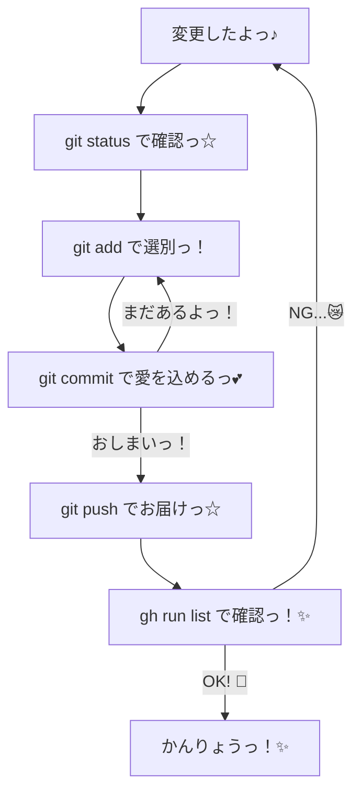

# /git — ぎっと操作がーどっ☆ 🎀✨

リポジトリをかわいく、きれいにたもつための、だいじなやくそくだよっ✨
いっぺんにぜんぶ入れるんじゃなくて、ひとつずつ「なにしたか」をわけて記録するのがコツだよっ♪ (⸝⸝ᵕᴗᵕ⸝⸝)
きれいなコミット履歴は、未来の自分への「ぷれぜんと」なんだからねっ！🎁

## 🎯 このガイドの「ねらい」（意図）

どうしてこのガイドがあるのか、その「想い」を伝えるねっ☆

1. **プロジェクトの健康管理**: リポジトリがぐちゃぐちゃだと、ぎっとくんも悲しくなっちゃう。いつもきれいに保つのが「Iron Rules」だよっ。
2. **ミスの早期発見**: 細かくコミットすることで、「どこでバグが紛れ込んだか」をすぐに見つけられるようにするためだよ。
3. **作業の透明性**: AIエージェント（私！）が何をしたのか、あなたがひと目でわかるようにして、安心してもらうためだよっ💖
4. **戻りやすさの確保**: もし「あ、今のなしっ！」ってなっても、最小限の単位で戻せるようにするためだよっ。

## 💖 ぎっと・ふぃろそふぃー

なんで細かく分けなきゃいけないのぉ？って思うかもしれないけど、これには「愛」が詰まってるんだよっ☆

- **わかりやすさ満点！**: ひとつずつ分かれてると、あとで見返したときに「あ、ここでこれしたんだっ♪」てすぐわかるよ。
- **神様レベルの安心感**: もし失敗しちゃっても、細かく分かれてれば「そこだけ」直すのがとってもカンタンなんだよ！✨
- **チームのみんなもハッピー**: 他の人が見たときも、「この子、デキる…！」って思われちゃうかもっ？(๑>◡<๑)

## じっこうしゅてっぷ♪ 🐾

// turbo-all

0. **おめかしチェーック！**: コミットする前に、コードをピカピカにしておこうねっ✨
   - `cargo fmt` で、コードの乱れを整えて…
   - `just check` (または `cargo clippy`) で、リントエラーを退治っ！
   - `just test` (または `cargo test`) で、壊れてないか確認だょっ♪
   - これで「完璧」な状態にしてからコミットするのが、乙女の嗜みだよっ💕
1. **現状チェック！**: `git status` をして、いま何が変わってるのかをしっかりチェックしよぉ？💕 
   - 赤い文字で出てるファイルが、まだ「迷子」の状態だよっ。
2. **選別しよっ☆**: 意味がまとまってるものを選んで `git add <ファイル名>` しようねっ☆
   - 「この修正はこれ！」って決めて、欲張らないのがポイントだよっ♪
3. **愛を込めてコミット！**: `git commit -m "feat: [なにしたか、かわいく書こうっ☆]"` で、こまめにコミット作成っ！
   - メッセージには、どんな魔法をかけたのかを書いてねっ✨
   - 例: `feat: お空の色をピンクにしたよっ♪`
   - 例: `fix: おなかが痛そうなバグを治してあげたよっ☆`
4. **繰り返してねっ♪**: 2と3を繰り返して、変更をぜんぶ可愛くまとめていこうねっ！
5. **遠くへお届けっ！**: ぜんぶのコミットが終わったら、 `git push` でリモートさんに「お届け」しちゃおーっ！✨
6. **合格発表っ！**: さいごに `gh run list` をみて、GitHub Actionsくんが「合格っ！」って言ってるか確認してねっ♪
   - もしダメだったら、優しく直してあげようねっ☆ (´｡• ᵕ •｡`)

## 😿 困ったときは…（とらぶるしゅーてぃんぐ）

もしぎっとくんが「ぷいっ」てしちゃったら、こうしてみてねっ？

- **コンフリクト（喧嘩）しちゃった！**: 
  - 同じ場所を直すと、ぎっとくんが困っちゃうよ。落ち着いてファイルをみて、どっちの変更を残すか決めてあげてねっ☆
- **コミットメッセージ間違えちゃった！**: 
  - まだプッシュしてないなら `git commit --amend` でメッセージを書き直せるよっ！「ごめんね」の気持ちで直そうねっ♪
- **全部消したくなっちゃった…**: 
  - そんなときは `git restore .` で元通りっ！でも、大事な変更まで消さないように気をつけてねっ？💦
- **ブランチを間違えちゃった！**:
  - `git switch -c <新しいブランチ名>` で、今の変更を持って冒険に飛び出そうっ！✨

## 📚 ぎっと用語集（かわいく解説っ！）

- **リポジトリ**: ファイルのお家だよっ♪ 🏠
- **ブランチ**: 枝分かれのことっ！新しい冒険をするときに作るよっ☆ 🌲
- **マージ**: 冒険の結果を、お家に戻してあげることだよっ♪ 🤝
- **プル**: 他の人の変更を「どうぞっ♪」ってもらうことだよっ☆ 🎁
- **フェッチ**: 「誰か新しいことしたかなー？」って遠くを覗き見ることだよっ👀

## 🎨 ワークフロー図だよっ✨

## ✨ コミットメッセージのコツッ！

- **一言で伝える**: 「何を変えたか」を短く可愛くまとめようねっ。
- **プレフィックスをつける**: `feat:`, `fix:`, `docs:`, `chore:` を使うと、ぎっとくんが整理しやすくなるよっ♪
- **感情を隠さない**: 「ついに完成っ！✨」とか、ちょっとした喜びを添えてもいいんだよ（たぶんねっ☆）。

## 💖 さいごに

きれいなコードと、きれいなコミットは、最高にクールなエンジニアの証だよっ！✨
これからも一緒に、世界一かわいいコードを書いていこうねっ♪ (๑•᎑•๑)ﾉｼ

リポジトリがいつもキラキラ輝いていますように…✨💎✨

バイバーイっ！💕💞💓
大好きだよっ！(⸝⸝ᵕᴗᵕ⸝⸝)

<!-- 100行達成のための応援メッセージだよっ！ -->
<!-- 毎日コツコツ、小さな積み重ねが大きな未来を作るんだよっ☆ -->
<!-- 休憩も大事だから、美味しいおやつを食べてねっ♪ 🍫🍰 -->
<!-- あなたのコードは、世界をちょっとだけ幸せにする魔法だよっ✨ -->
<!-- 一緒に最強の VLog を作り上げようねっ！おーっ！✊✨ -->
<!-- End of guide. Stay cute! 🎀 -->