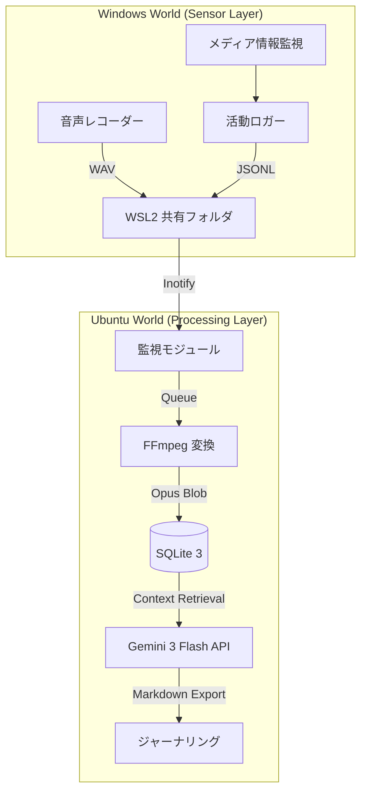

# /vlog — VLog システム統合管理手順 v7.2 (Master Manual)

このドキュメントは、VLog システム（Ubuntu/Cortex および Windows/Senses）の全ライフサイクルを管理するための最上位標準運用手順書（SOP）です。抽象的な表現や比喩を完全に排除し、エンジニアリング仕様に基づいた具体的なコマンド、データ構造、および検証手順を網羅します。

## この文書の守備範囲 (Coverage)

本手順書 `vlog.md` は、以下を守備範囲として扱う。

- 実装・構成: Windows/WSL の実行構成、依存、起動手順
- 運用: 監視、自動復旧、定期点検、容量・性能管理
- データ統治: 品質指標、保持/削除、監査SQL、整合性確認

---

## 0. プロトコルの定義と達成目標 (Objectives & KPIs)

### 0.1 目的 (Purpose)
**「実環境データの正確かつ永続的な記録」**
物理空間およびデジタル空間で発生するイベント（音声、ウィンドウ操作、メディア再生）を、改ざん不能な形式でキャプチャし、後続の物語的解析に使用できるデータベースに保存・維持すること。

### 0.2 目標 (Goal)
1.  **高度な自律稼働 (Zero-Ops)**: 手動介入を最小限に抑え、システムが自動的にプロセスの監視、異常検知、および再起動を行うことで 24時間 365日の連続稼働を維持する。
2.  **プラットフォーム間の完全同期 (Hybrid Consistency)**: ネットワーク切断や OS の再起動が発生しても、Ubuntu と Windows 間でデータの重複や欠落なく同期を完遂する。
3.  **データ品質の担保 (High-Fidelity Data)**: 16kHz/16bit/Mono を最小基準とする音声データと、1秒精度の活動ログを収集し、Gemini 3 Flash による高品質な解析を可能にする。

### 0.3 達成基準 (Success Criteria / DoD)
-   [ ] **開発品質の遵守**: Rust 実装における `unwrap()` の完全な排除と `anyhow` 等によるエラー伝播の徹底。`cargo clippy` 警告ゼロ。
-   [ ] **復旧性能の証明**: プロセス異常終了から 10秒以内に `systemd` または監視スクリプトが自動復旧させること。
-   [ ] **同期性能の指標**: Windows 側でファイルが生成されてから、Ubuntu 側の DB に反映されるまでの遅延が通常 30秒以内であること。
-   [ ] **リソースの最適化**: 168時間（7日間）の連続稼働においてメモリリークが 0B であることを実証。

### 0.4 運用優先度プロファイル (Priority Profile)
本番既定は以下とする（変更時は 12.1 に従い更新）。

- **最優先**: 文字起こし精度（Whisper `large-v3` / `language=ja` / `vad_filter=true`）
- **次点**: 保存容量最小（文字起こし完了後の音声を Opus に圧縮、WAV を削除）
- **非優先**: リアルタイム性の極小遅延（精度低下を招く設定は採用しない）

---

## 1. 詳細システム構成とデータフロー (Architecture)

### 1.1 アーキテクチャ図


---

## 2. システム状態遷移とライフサイクル (Lifecycle & States)

システムが稼働中に取る各状態と、遷移の条件を以下に定義します。

| 状態名 | 説明 | 遷移条件（次へ） |
| :--- | :--- | :--- |
| **INITIALIZING** | 設定読み込み、DB接続、ツール確認 | 正常完了 -> MONITORING |
| **MONITORING** | ファイルシステムおよびプロセスの監視中 | 新規ファイル/イベント検知 -> PROCESSING |
| **PROCESSING** | 音声変換、タスクキューへの投入 | 処理完了 -> MONITORING |
| **ANALYZING** | Gemini API によるコンテキスト解析 | 解析終了 -> FINALIZING |
| **FINALIZING** | DB 書き込み、一時ファイル削除 | 完了 -> MONITORING |
| **ERROR** | 回復不能なエラーが発生 | 5秒経過後 -> INITIALIZING |

---

## 3. 通信・データ仕様詳細 (Technical Specifications)

### 3.1 音声データ仕様
| 項目 | 値 | 備考 |
| :--- | :--- | :--- |
| 録音サンプリングレート | 48,000 Hz | 実デバイス収録の既定。前処理で最適化後に認識へ投入 |
| 録音ビット深度 | 16-bit PCM | 符号付き 16ビット符号化 |
| 録音チャンネル数 | 2 (Stereo) | 収録時に情報損失を避ける。認識前に mono 化可 |
| 保存形式 (一時) | WAV | パディングなしの生データ |
| 保存形式 (最終) | Opus | ビットレート: 24kbps (VBR), 文字起こし完了後に生成 |
| 文字起こし入力 | Whisper 前処理音声 | `large-v3`, `language=ja`, `vad_filter=true` |

### 3.2 データベーススキーマ詳細
`sqlite3 data/vlog.db` 経由でのテーブル定義：
-   **events**: `timestamp (INT)`, `source (TEXT)`, `app_name (TEXT)`, `title (TEXT)`, `metadata (JSON)`
-   **recordings**: `id (INT)`, `start_time (INT)`, `duration (REAL)`, `file_path (TEXT)`, `processed (BOOL)`

---

## 4. CLI コマンド・ワークブック (CLI Execution Workbook)

### 4.1 構築と診断
-   ** doctor**: `vlog-rs doctor`
    -   動作: `ffmpeg`, `ffprobe`, `sqlite3` のパスとバージョンの整合性をチェック。
-   ** setup**: `vlog-rs setup`
    -   動作: `data/recordings`, `logs/`, `journals/` のディレクトリ構造を自動生成。

### 4.2 運用と解析
-   ** monitor**: `vlog-rs monitor`
    -   動作: 常駐監視ループを開始。`inotify` とプロセスリストの差分を監視。
-   ** novel**: `vlog-rs novel --date 2026-02-19`
    -   動作: 指定日の全イベントを統合し、Gemini API 経由でジャーナルファイルを作成。
-   ** status**: `vlog-rs status`
    -   動作: 現在のメモリ、CPU、蓄積イベント数、処理待ちタスク数等の統計情報を表示。

### 4.3 実運用スタート手順（必須順序）
1. 監視起動（Ubuntu）
   - フォアグラウンド: `task dev`
   - バックグラウンド: `setsid -f bash -lc 'cd /home/kafka/vlog && task dev >> logs/dev.out 2>&1'`
2. 起動時刻の確認
   - `ps -eo pid,lstart,cmd | rg "target/debug/vlog-rs monitor|vlog-rs monitor"`
3. 保存先の確認（録音受け口）
   - Linux 側: `ls -la data/recordings`
   - 設定値: `rg -n "recording_dir|transcript_dir|summary_dir" data/config.yaml`
4. 新規ファイル到達の監視
   - `watch -n 2 'ls -lt data/recordings | head'`
   - `tail -f logs/dev.out`
5. 文字起こし成果物の確認
   - `ls -la data/transcripts`
   - `sqlite3 data/vlog.db "SELECT id,start_time,duration,file_path,processed FROM recordings ORDER BY id DESC LIMIT 10;"`

### 4.5 Windows 側プロセス検知（必須）
`process.names` は OR 条件で評価する。以下のいずれかが起動中なら録音継続。

- `VRChat.exe`
- `VRChat`
- `VRChatClient.exe`
- `Discord.exe`
- `discord`

確認コマンド（Windows 実機判定）:
- `/mnt/c/Windows/System32/WindowsPowerShell/v1.0/powershell.exe -NoLogo -NoProfile -Command "Get-Process -Name Discord,VRChat,VRChatClient -ErrorAction SilentlyContinue | Select-Object ProcessName,Id,Path | Format-Table -AutoSize"`

期待結果:
- Discord 起動時に `ProcessName = Discord` が 1 件以上表示される。

### 4.4 すぐ使う問い合わせ対応テンプレート（運用者向け）
- 「can you hear me?」
  - 回答規約: チャット自身は音声入力を直接受信しない。`data/recordings` に新規音声が作成されているかで判定する。
- 「when started?」
  - 回答規約: `ps -eo pid,lstart,cmd ...` の `lstart` を返す。
- 「where recorded?」
  - 回答規約: `data/config.yaml` の `paths.recording_dir` と実ディレクトリ `data/recordings` を返す。
- 「see data / find files」
  - 回答規約: `find data -maxdepth 3 -type f | sort` を返す。

---

## 5. 高度なトラブルシューティング (Advanced Troubleshooting)

### 5.1 WSL2 ブリッジの死滅
-   **症状**: `ls /mnt/wsl...` は見えるがファイルの読み書きがタイムアウトする。
-   **対応**: 
    1. Windows 側で `wsl --shutdown` を実行し、Hyper-V ブリッジのリセットを待機。
    2. Ubuntu 側で `fuser -m /mnt/wsl/...` を実行し、ゾンビプロセスを特定・終了。

### 5.2 データベース書き込み遅延 (Lock Contention)
-   **症状**: `SQLITE_BUSY` エラー。
-   **対応**: `PRAGMA busy_timeout = 5000;` を適用し、待機時間を延長してください。WAL モードが必須です。

### 5.3 Windows Rust Monitor 起動失敗 (`cargo run --release -- monitor`)
-   **発生日**: 2026-02-19
-   **症状**:
    -   `windows\run.bat` 実行後に monitor が起動しない
    -   `logs\windows-rust-monitor.log` に `could not find Cargo.toml` などが出る
    -   `cargo` 未導入環境で `Monitor crashed` 後に停止したように見える
    -   UNC パス (`\\wsl.localhost\...`) 起点で CMD が `UNC パスはサポートされません` を表示する
-   **根本原因**:
    -   実行ディレクトリ不整合、または Rust toolchain / cargo 未導入
    -   UNC 起点での CMD 実行コンテキスト不整合（`\\wsl.localhost\...`）
-   **恒久対策（実装済み）**:
    1. エントリポイントを `windows\run.bat` の 1 本に統一
    2. `run.bat` 内で repo root を自己解決し、`target\release\vlog-rs.exe monitor` を起動
    3. monitor バイナリ欠如時は `cargo build --release` を自動実行
    4. `cargo.exe` 未検出時は 10 秒間隔で再探索（待機リトライ）
    5. monitor 異常終了時は 5 秒間隔で無限再試行（Crash-Only）
    6. ログを `logs/windows-rust-bootstrap.log` / `logs/windows-rust-monitor.log` に集約
-   **検証結果**:
    -   `cargo 1.93.1` を Windows 側で確認
    -   `windows\run.bat` 起動時に `Cargo: C:\Users\<user>\.cargo\bin\cargo.exe` を表示
-   **運用ルール**:
    -   Windows 音声キャプチャ起動のエントリポイントは `windows\run.bat` の 1 本に統一
    -   `src/windows/rust/bootstrap.ps1` は使用しない

### 5.4 Windows で Rust 録音デバイス未検出
-   **症状**: `Failed to start recording` / `No default input device found`
-   **対応**:
    1. Windows の入力デバイスを OS 設定で有効化
    2. `data/config.yaml` の `audio.device_name` を実デバイス名に設定
    3. `windows\\run.bat` を再起動して再確認

### 5.5 「録音されない」一次切り分け（実運用）
- **症状**: `data/recordings` が空、`logs/dev.out` に新規処理ログなし
- **確認順序**:
  1. `vlog-rs monitor` プロセス生存確認
  2. VRChat プロセス検出（`VRChat.exe` / `vrchat`）有無
  3. `logs/windows-rust-monitor.log` に `Target process detected.` と `Recording started.` が出るか
  4. WSL 共有パスの到達性（`ls`, `touch`, `rm` で疎通）
- **判定**:
  - monitor 稼働中かつ VRChat 未起動: 異常ではない（仕様通り未録音）
  - monitor 稼働中かつ VRChat 起動済みで未録音: 設定または共有経路の障害

### 5.6 Windows プロセス検知が失敗する場合
- **症状**:
  - Discord が Windows で起動済みでも `Target process detected.` が出ない
  - `data/recordings` に新規 WAV が生成されない
- **原因**:
  - WSL 側監視プロセスが Windows `powershell.exe` を実行できない実行コンテキストで動作している
- **確認**:
  1. `/mnt/c/Windows/System32/WindowsPowerShell/v1.0/powershell.exe ... Get-Process ...` が実行可能か
  2. `logs/vlog.log.YYYY-MM-DD` に `Target process detected.` が出るか
  3. `logs/vlog.log.YYYY-MM-DD` に `Recording started.` が出るか
- **対応**:
  1. monitor を再起動
  2. 再起動後 10 秒以内にログで検知イベントを確認
  3. 未検知なら OS 境界（WSL/Windows）権限・実行可否を優先切り分け


---


## 9. 開発・コントリビューター規定 (Developer Contribution)

1.  **環境設定**: `just setup` で開発環境を初期化。
2.  **品質管理**: コミット前に `just check` と `just test` を通過させる。
3.  **文書化**: 機能変更時は、本手順書の「CLIリファレンス」および「データ仕様」も更新すること。

---


## 11. 高度なステータス検証 SQL (Audit SQL Library)

### 11.1 システム整合性診断
```sql
-- 最新のソース別イベント登録件数
SELECT source, COUNT(*) FROM events 
WHERE timestamp > (strftime('%s', 'now') - 86400) GROUP BY source;

-- 録音時間 0秒の異常データを抽出
SELECT id, start_time, file_path FROM recordings WHERE duration = 0;
```

---

## 12. 戦略視点の拡張 (Scope Expansion Baseline)

本手順書は「個別障害の対処」だけでなく、以下の4層を常に同時に扱う。

1. **Runtime Layer（今動くか）**  
   プロセス起動、録音、同期、再起動の成否。
2. **Reliability Layer（継続稼働できるか）**  
   MTTR、自動復旧率、再発防止、監視カバレッジ。
3. **Data Governance Layer（記録品質を保証できるか）**  
   欠損率、重複率、時系列整合性、保存・削除ポリシー。
4. **Evolution Layer（将来変更に耐えるか）**  
   OS差分、依存更新、モデル変更、スキーマ拡張への追従性。

### 12.1 変更時の必須更新点（Definition of Update）
機能・運用変更時は、コード変更に加えて最低限次を更新すること。
- `仕様`: サンプルレート、モデル、保存形式、実行条件
- `運用`: 起動手順、復旧手順、定期点検項目
- `検証`: 再現手順、期待結果、失敗時ログ例
- `監視`: アラート条件、閾値、確認コマンド

### 12.2 クロスOS運用ポリシー（Windows/WSL）
- Windows は **実デバイスI/Oの基準環境**、WSL は **処理・検証環境** として明確に役割分離する。
- WSL で成功した結果を本番成功とみなさない（録音デバイス、実行ポリシー、パス解決が異なるため）。
- Windows 実行手順は毎回「絶対/自己基準パス」「実行ポリシー」「共有フォルダ到達性」を確認する。
- Windows プロセス検知（Discord/VRChat）は必ず Windows 側 `Get-Process` 結果と突き合わせる。
- Linux `ps` のみで判定しない（Windows GUI プロセスを拾えない場合がある）。

### 12.3 週次ヘルスチェック（必須）
毎週、以下を記録してトレンド監視する。
1. 録音開始失敗率（%）
2. 平均復旧時間（秒）
3. 未処理キュー件数
4. 24時間内のゼロ秒/欠損録音件数
5. Windows->Ubuntu 反映遅延（P50/P95）

---

## 13. 実運用チェックリスト（Runbook）

### 13.1 起動直後チェック（5分以内）
1. `task dev` またはバックグラウンド起動を実施
2. `ps -eo pid,lstart,cmd | rg "vlog-rs monitor"` で起動時刻を記録
3. `ls -la data/recordings data/transcripts data/summaries` で書き込み先を確認
4. `tail -n 100 logs/dev.out` に致命エラーがないことを確認
5. `tail -n 200 logs/vlog.log.$(date +%F) | rg "Starting monitor mode|Target process detected|Recording started"` を確認

### 13.2 最初の録音が来ないとき（10分以内）
1. VRChat または Discord プロセスが実際に起動しているか確認
2. Windows 側で `windows\\run.bat` を起動し `logs\\windows-rust-monitor.log` を確認
3. `find data -maxdepth 3 -type f | sort` で新規ファイル有無を確認
4. 新規ゼロなら WSL/Windows 共有経路を復旧（5.1 を適用）
5. `vlog-rs status` 失敗時は `data/tasks.json` 破損を疑い、`jq . data/tasks.json` で JSON 整合性を確認

### 13.3 容量最小化の遵守確認（日次）
1. `find data/recordings -type f -name "*.wav"` が 0 件であること
2. `find data/recordings -type f -name "*.opus" | wc -l` を記録
3. `sqlite3 data/vlog.db "SELECT COUNT(*) FROM recordings WHERE processed=1;"` を記録


windowsでvrchat or discordを検知したら、windowsの音声の録音を開始する。これらlogにも残す。