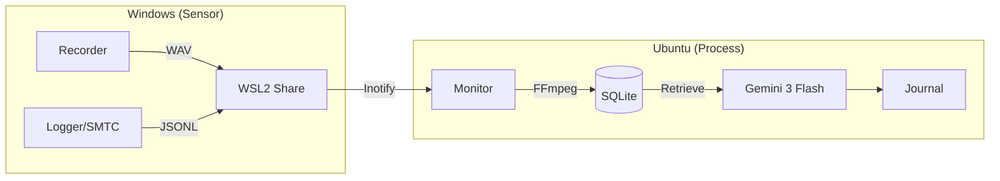

# /vlog — VLog 統合管理手順 v8.0

## 0. プロトコル要諦 (Core Protocol)
- **目的**: 実環境データ（音声・操作・メディア）の正確かつ永続的な記録と解析。
- **目標**: Zero-Ops（自律稼働）、Hybrid Consistency（OS間同期）、High-Fidelity（48kHz/16bit）。

### 最重要完了基準 (Critical Success Criteria)
1. **完全自律復旧**: 障害発生から10秒以内に自動復旧し、ユーザーの手動介入を排すること。
2. **多角的・側面的な動作確証 (Best-Effort Verification)**: 直接実行不能な制約下で、以下の三点観測により動作を「確信」に至らせること。
    - **L (Log)**: `windows-rust-monitor.log` の最新行に `Recording started` を検知。
    - **F (File)**: `data/recordings` に数秒おきにサイズ増加する `.wav` を検知。
    - **P (Process)**: `powershell.exe Get-Process` 経由で `vlog-rs.exe` の CPU 使用率が 0% 超であることを確認。
3. **Windows/WSL 同期完遂**: UNC パス・権限問題を自動解決し、ビルド・常駐を達成すること。
4. **透明なログ運用**: 起動時の Truncate により「過去の幻影」を排除し、現在のみを直視すること。
5. **不変のデータ完全性**: 168時間連続稼働での欠損・リーク・重複ゼロ。

- **エージェントの行動指針**: 
    1. **WSL 検証アンカー (WSL Verification Anchor)**: Windows 実機テストの前に、WSL 環境で以下を実行し「ロジックの正当性」を 100% 保証せよ。
        - `vlog-rs doctor`: 共通バイナリの依存関係と整合性を確認。
        - `vlog-rs setup`: ディレクトリ構造と初期設定の生成ロジックを確認。
        - `vlog-rs status`: 内部状態管理モジュールの健全性を確認。
        - *WSL での成功は、共通コードベースである Windows 側の「論理的動作」の保証となる。*
    2. **直接実行の優先**: Windows 側でコマンド実行が可能ならば、迷わず直接テスト（`run.bat` のキックと終了コード確認）を実施せよ。
    3. **多角的・側面的な動作確証 (Best-Effort Verification)**: 直接実行不能な環境では、以下の三点観測（L-F-P法）により「確信」に至らせること。
        - **L (Log)**: `windows-rust-monitor.log` の最新行に `Recording started` を検知。
        - **F (File)**: `data/recordings` に数秒おきにサイズ増加する `.wav` を検知。
        - **P (Process)**: `powershell.exe Get-Process` 経由で `vlog-rs.exe` の存在とリソース消費を確認。
    4. **ログ設計の継続的改善 (Continuous Logging Evolution)**: 
        - 「デバッグの着実性」を最優先し、情報不足を感じた際は即座にログ設計（構造・レベル・詳細度）を見直し、改善案を実装せよ。
        - 常に「未来の自分がこのログだけで原因を特定できるか」を自問し、改善をルーチン化すること。
    5. **不透明の排除**: 「直接実行できない」を停滞の理由とせず、WSL 側を「検証可能な相似点」として活用し、確証が得られない場合は最短の検証コマンドを提示して並走せよ。
    6. **完遂後のリポジトリ整理**: タスクが完全に完了した後は、必ず [/git](file:///home/kafka/vlog/.agent/workflows/git.md) ワークフローを呼び出し、コミット・プッシュを確実に実施せよ。

- **DoD**: Rust unwrap禁止、systemd/monitoringによる10秒以内復旧、同期遅延30s以内。
- **優先プロファイル**: 1. 精度 (Whisper large-v3) > 2. 容量最小化 (Opus圧縮) > 3. リアルタイム性。

## 1. 構成・データフロー (Architecture)

## 2. 状態遷移 & 仕様 (Specs & States)
- **States**: INIT -> MONITORING <-> PROCESSING / ANALYZING -> FINALIZING (ERROR -> INIT after 5s)
- **Audio**: 48kHz/16bit Stereo WAV (一時) -> 24kbps Opus (最終). Whisper: `large-v3/ja/vad_filter=true`.
- **DB (vlog.db)**: `events` (timestamp, source, metadata), `recordings` (start_time, duration, processed).

## 3. CLI ワークブック (CLI Operations)
### 3.1 診断・構築
- `vlog-rs doctor`: 依存ツール (ffmpeg, sqlite3) 整合性チェック。
- `vlog-rs setup`: `data/recordings`, `logs/`, `journals/` 生成。

### 3.2 実行・監視
- `task dev`: 監視起動（フォアグラウンド）。
- `setsid -f bash -lc 'cd /home/kafka/vlog && task dev >> logs/dev.out 2>&1'`: バックグラウンド起動。
- `vlog-rs status`: メモリ/CPU/キュー/統計表示。
- `vlog-rs novel --date YYYY-MM-DD`: 指定日のジャーナル生成。

### 3.3 運用点検コマンド
- **生存確認**: `ps -eo pid,lstart,cmd | rg "vlog-rs monitor"`
- **パス確認**: `rg "recording_dir" data/config.yaml`
- **疎通確認**: `watch -n 2 'ls -lt data/recordings | head'`
- **DB確認**: `sqlite3 data/vlog.db "SELECT * FROM recordings ORDER BY id DESC LIMIT 5;"`

## 4. Windows 連携プロトコル (Windows/WSL Sync)
- **検知対象**: `VRChat.exe`, `Discord.exe` 等（OR条件）。
- **Win確認**: `powershell.exe -Command "Get-Process Discord,VRChat | Select Id,Path"`
- **エントリ**: `windows/run.bat` (UNC解決) -> `bootstrap.ps1` (環境構築・ビルド) -> `vlog-rs.exe monitor`。
- **注意**: WSLの `ps` のみで判定不可。必ず Windows 側の `Get-Process` と突き合わせる。

## 5. トラブルシューティング (Troubleshooting)
| 事象 | 原因・対応 |
| :--- | :--- |
| WSL共有死滅 | `wsl --shutdown` 実行後の再起動。`fuser` でゾンビプロセス排除。 |
| SQLITE_BUSY | WALモード確認。`PRAGMA busy_timeout = 5000;` 適用。 |
| 録音されない | `vlog-rs monitor` 生存、Winプロセス検知（logs/dev.out）、共有パス疎通を確認。 |
| Win監視失敗 | WSLから `powershell.exe` 叩けるか確認。Monitor再起動 10s 以内のログ確認。 |
| デバイス未検出 | Windows側でデバイス有効化。`data/config.yaml` の `device_name` 修正。 |

## 6. 実運用チェックリスト & 規約 (Runbook & Rules)
### 6.1 運用ルール
- **週次診断**: 録音失敗率、復旧時間、反映遅延、欠損録音数を記録。
- **データ管理**: `*.wav` は即削除、`*.opus` 変換遵守。
- **変更規約**: 仕様・手順・検証・監視全項目の同時更新。

### 6.2 問い合わせ対応
- Q: 「can you hear me?」 -> A: `data/recordings` の新規WAV生成有無で回答。
- Q: 「when started?」 -> A: `ps` の `lstart` を回答。
- Q: 「find files」 -> A: `find data -maxdepth 3` 結果を回答。

### 6.3 開発規定
1. `just setup` で初期化。
2. `just check` / `just test` 必須。
3. 機能変更時は本ドキュメント（CLI/仕様）も同期。

---
*WindowsでVRC/Discord検知 -> 録音開始 & ログ記録。*