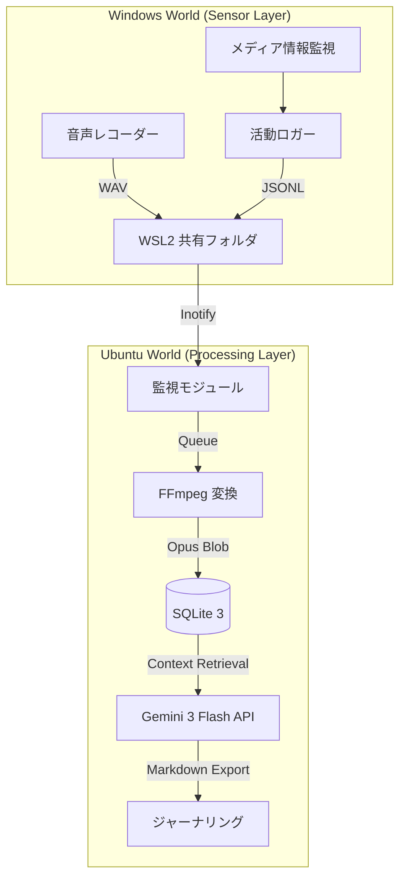

# /vlog — VLog システム統合管理手順 v7.0 (Master Manual)

このドキュメントは、VLog システム（Ubuntu/Cortex および Windows/Senses）の全ライフサイクルを管理するための最上位標準運用手順書（SOP）です。抽象的な表現や比喩を完全に排除し、エンジニアリング仕様に基づいた具体的なコマンド、データ構造、および検証手順を網羅します。

---

## 0. プロトコルの定義と達成目標 (Objectives & KPIs)

### 0.1 目的 (Purpose)
**「実環境データの正確かつ永続的な記録」**
物理空間およびデジタル空間で発生するイベント（音声、ウィンドウ操作、メディア再生）を、改ざん不能な形式でキャプチャし、後続の物語的解析に使用できるデータベースに保存・維持すること。

### 0.2 目標 (Goal)
1.  **高度な自律稼働 (Zero-Ops)**: 手動介入を最小限に抑え、システムが自動的にプロセスの監視、異常検知、および再起動を行うことで 24時間 365日の連続稼働を維持する。
2.  **プラットフォーム間の完全同期 (Hybrid Consistency)**: ネットワーク切断や OS の再起動が発生しても、Ubuntu と Windows 間でデータの重複や欠落なく同期を完遂する。
3.  **データ品質の担保 (High-Fidelity Data)**: 16kHz/16bit/Mono を最小基準とする音声データと、1秒精度の活動ログを収集し、Gemini 3 Flash による高品質な解析を可能にする。

### 0.3 達成基準 (Success Criteria / DoD)
-   [ ] **開発品質の遵守**: Rust 実装における `unwrap()` の完全な排除と `anyhow` 等によるエラー伝播の徹底。`cargo clippy` 警告ゼロ。
-   [ ] **復旧性能の証明**: プロセス異常終了から 10秒以内に `systemd` または監視スクリプトが自動復旧させること。
-   [ ] **同期性能の指標**: Windows 側でファイルが生成されてから、Ubuntu 側の DB に反映されるまでの遅延が通常 30秒以内であること。
-   [ ] **リソースの最適化**: 168時間（7日間）の連続稼働においてメモリリークが 0B であることを実証。

---

## 1. 詳細システム構成とデータフロー (Architecture)

### 1.1 アーキテクチャ図


---

## 2. システム状態遷移とライフサイクル (Lifecycle & States)

システムが稼働中に取る各状態と、遷移の条件を以下に定義します。

| 状態名 | 説明 | 遷移条件（次へ） |
| :--- | :--- | :--- |
| **INITIALIZING** | 設定読み込み、DB接続、ツール確認 | 正常完了 -> MONITORING |
| **MONITORING** | ファイルシステムおよびプロセスの監視中 | 新規ファイル/イベント検知 -> PROCESSING |
| **PROCESSING** | 音声変換、タスクキューへの投入 | 処理完了 -> MONITORING |
| **ANALYZING** | Gemini API によるコンテキスト解析 | 解析終了 -> FINALIZING |
| **FINALIZING** | DB 書き込み、一時ファイル削除 | 完了 -> MONITORING |
| **ERROR** | 回復不能なエラーが発生 | 5秒経過後 -> INITIALIZING |

---

## 3. 通信・データ仕様詳細 (Technical Specifications)

### 3.1 音声データ仕様
| 項目 | 値 | 備考 |
| :--- | :--- | :--- |
| サンプリングレート | 16,000 Hz | 音声認識の標準モデルに準拠 |
| ビット深度 | 16-bit PCM | 符号付き 16ビット符号化 |
| チャンネル数 | 1 (Mono) | 指向性マイクによる単一ソース |
| 保存形式 (一時) | WAV | パディングなしの生データ |
| 保存形式 (最終) | Opus | ビットレート: 64kbps (VBR) |

### 3.2 データベーススキーマ詳細
`sqlite3 data/vlog.db` 経由でのテーブル定義：
-   **events**: `timestamp (INT)`, `source (TEXT)`, `app_name (TEXT)`, `title (TEXT)`, `metadata (JSON)`
-   **recordings**: `id (INT)`, `start_time (INT)`, `duration (REAL)`, `file_path (TEXT)`, `processed (BOOL)`

---

## 4. CLI コマンド・ワークブック (CLI Execution Workbook)

### 4.1 構築と診断
-   ** doctor**: `vlog-rs doctor`
    -   動作: `ffmpeg`, `ffprobe`, `sqlite3` のパスとバージョンの整合性をチェック。
-   ** setup**: `vlog-rs setup`
    -   動作: `data/recordings`, `logs/`, `journals/` のディレクトリ構造を自動生成。

### 4.2 運用と解析
-   ** monitor**: `vlog-rs monitor`
    -   動作: 常駐監視ループを開始。`inotify` とプロセスリストの差分を監視。
-   ** novel**: `vlog-rs novel --date 2026-02-19`
    -   動作: 指定日の全イベントを統合し、Gemini API 経由でジャーナルファイルを作成。
-   ** status**: `vlog-rs status`
    -   動作: 現在のメモリ、CPU、蓄積イベント数、処理待ちタスク数等の統計情報を表示。

---

## 5. 高度なトラブルシューティング (Advanced Troubleshooting)

### 5.1 WSL2 ブリッジの死滅
-   **症状**: `ls /mnt/wsl...` は見えるがファイルの読み書きがタイムアウトする。
-   **対応**: 
    1. Windows 側で `wsl --shutdown` を実行し、Hyper-V ブリッジのリセットを待機。
    2. Ubuntu 側で `fuser -m /mnt/wsl/...` を実行し、ゾンビプロセスを特定・終了。

### 5.2 データベース書き込み遅延 (Lock Contention)
-   **症状**: `SQLITE_BUSY` エラー。
-   **対応**: `PRAGMA busy_timeout = 5000;` を適用し、待機時間を延長してください。WAL モードが必須です。

---

## 6. セキュリティとハードニング (Security Hardening)

### 6.1 リソース制限の設定例 (systemd)
`/etc/systemd/system/vlog.service` に以下を追加します。
-   `CPUQuota=20%`: Cortex プロセスの CPU 使用率を固定。
-   `MemoryMax=512M`: 物理メモリ消費量の上限。

### 6.2 プロセスレベルのサンドボックス
-   `ProtectSystem=full`: システムディレクトリへの書き込み禁止。
-   `NoNewPrivileges=yes`: 実行中の権限昇格を無効化。
-   `PrivateTmp=yes`: システム全体の一時ディレクトリから隔離。

---

## 7. バックアップとデータ保持 (Data Retention & Backup)

### 7.1 保持ポリシー
-   **生音声 (WAV)**: 圧縮完了後に即座に物理削除し、ストレージを解放。
-   **ジャーナル (Markdown)**: 永続保存。Git 等のバージョン管理システムへの自動プッシュを推奨。

### 7.2 バックアップ手順
1.  **日次**: `vlog.db` のスナップショットを作成：`cp data/vlog.db data/vlog_$(date +%F).db`
2.  **週次**: 過去 7日分の Opus ファイルをアーカイブ：`tar -czf music_$(date +%F).tar.gz data/recordings/*.opus`

---

## 8. 保守（メンテナンス） (Weekly Maintenance)

1.  **DB最適化**: `sqlite3 data/vlog.db "VACUUM;"`
2.  **一時ファイルの削除**: `just clean`
3.  **依存関係の更新**: `cargo update` による脆弱性の解消。

---

## 9. 開発・コントリビューター規定 (Developer Contribution)

1.  **環境設定**: `just setup` で開発環境を初期化。
2.  **品質管理**: コミット前に `just check` と `just test` を通過させる。
3.  **文書化**: 機能変更時は、本手順書の「CLIリファレンス」および「データ仕様」も更新すること。

---

## 10. ハードウェア要件 (System Spec Requirements)

-   **CPU**: 4コア以上 (AVX2 命令セット対応必須)。
-   **RAM**: 8GB 以上 (WSL2 分割分 4GB を含む)。
-   **Network**: 安定した内部 SMB / WSL ブリッジ通信。
-   **Storage**: NVMe SSD 推奨（SQLite I/O 削減のため）。

---

## 11. 高度なステータス検証 SQL (Audit SQL Library)

### 11.1 システム整合性診断
```sql
-- 最新のソース別イベント登録件数
SELECT source, COUNT(*) FROM events 
WHERE timestamp > (strftime('%s', 'now') - 86400) GROUP BY source;

-- 録音時間 0秒の異常データを抽出
SELECT id, start_time, file_path FROM recordings WHERE duration = 0;
```

---

## 付録：用語定義 (Glossary)

-   **Cortex**: 中央処理・解析基盤（Ubuntu）。
-   **Senses**: 入力・捕捉エージェント（Windows）。
-   **Iron Rules**: 品質維持のための絶対的開発規約（unwrap 禁止等）。
-   **Zero-Ops**: 自律稼働状態（手動介入なし）の呼称。
-   **Crash-Only**: 異常発生時の即座な再起動を前提とした設計思想。

---

*VLog 統合管理プロトコル Ver 7.0.0 — 標準技術運用手順書*
