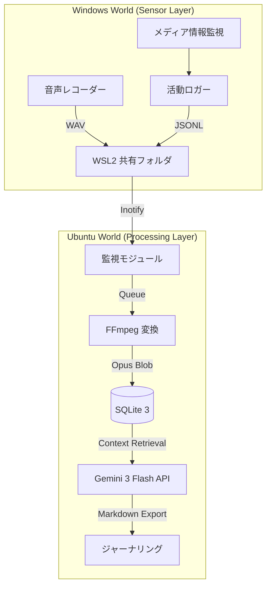

# /vlog — VLog システム統合管理手順 v6.2 (Comprehensive Manual)

このドキュメントは、VLog システム（Ubuntu/Cortex および Windows/Senses）の全ライフサイクルを管理するための最上位標準運用手順書（SOP）です。抽象的な表現や比喩を完全に排除し、実務的なエンジニアリング仕様、コマンド、データ構造、および検証手順を網羅します。

---

## 0. 基本定義と達成目標 (Objectives & KPIs)

### 0.1 目的 (Purpose)
**「実環境データの正確かつ永続的な記録」**
物理空間およびデジタル空間で発生するイベント（音声、ウィンドウ操作、メディア再生）を、改ざん不能な形式でキャプチャし、後続の物語的解析に使用できるデータベースに保存・維持すること。

### 0.2 目標 (Goal)
1.  **高度な自律稼働 (Zero-Ops)**: 手動介入を最小限に抑え、システムが自動的にプロセスの監視、異常検知、および再起動を行うことで 24時間 365日の連続稼働を維持する。
2.  **プラットフォーム間の完全同期 (Hybrid Consistency)**: ネットワーク切断や OS の再起動が発生しても、Ubuntu と Windows 間でデータの重複や欠落なく同期を完遂する。
3.  **データ品質の担保 (High-Fidelity Data)**: 16kHz/16bit/Mono を最小基準とする音声データと、1秒精度の活動ログを収集し、Gemini 3 Flash による高品質な解析を可能にする。

### 0.3 達成基準 (Success Criteria / DoD)
-   [ ] **開発品質の遵守**: 
    -   Rust 実装における `unwrap()` の完全な排除と `anyhow` によるエラー伝播の徹底。
    -   `cargo clippy` 警告ゼロ、および `cargo test` の全件合格。
-   [ ] **復旧性能の証明**: 
    -   プロセス異常終了から 10秒以内に `systemd` または監視スクリプトが自動復旧させること。
    -   `systemctl status vlog` で `Active: active (running)` が維持されていること。
-   [ ] **同期性能の指標**: 
    -   Windows 側でファイルが生成されてから、Ubuntu 側の DB に反映されるまでの遅延が通常 30秒以内であること。
-   [ ] **リソースの最適化**: 
    -   168時間の連続稼働試験において、リークなし（メモリ使用量が一定範囲内）であることを実証。
    -   Windows エージェントのワーキングセット（常駐メモリ）が 15MB 以下であること。

---

## 1. システム構成と詳細仕様 (Architecture Detail)

### 1.1 アーキテクチャ図


---

## 2. システム状態遷移定義 (State Transitions)

システムが稼働中に取る各状態と、遷移の条件を以下に定義します。

| 状態名 | 説明 | 遷移条件（次へ） |
| :--- | :--- | :--- |
| **INITIALIZING** | 設定読み込み、DB接続、ツール確認 | 正常完了 -> MONITORING |
| **MONITORING** | ファイルシステムおよびプロセスの監視中 | 新規ファイル/イベント検知 -> PROCESSING |
| **PROCESSING** | 音声変換、タスクキューへの投入 | 処理完了 -> MONITORING |
| **ANALYZING** | Gemini API によるコンテキスト解析 | 解析終了 -> FINALIZING |
| **FINALIZING** | DB 書き込み、一時ファイル削除 | 完了 -> MONITORING |
| **ERROR** | 回復不能なエラーが発生 | 5秒経過後 -> INITIALIZING |

---

## 3. 開発者向けセットアップ手順 (Developer Setup Guide)

新規に開発・運用環境を構築するための詳細手順です。

### 3.1 Ubuntu (Cortex) 側の環境構築
1.  **依存ツールのインストール**:
    ```bash
    sudo apt update && sudo apt install -y ffmpeg build-essential pkg-config libssl-dev
    ```
2.  **Rust ツールチェインのセットアップ**:
    ```bash
    curl --proto '=https' --tlsv1.2 -sSf https://sh.rustup.rs | sh
    rustup component add clippy rustfmt
    ```
3.  **プロジェクトの初期化**:
    ```bash
    git clone <REPOSITORY_URL> vlog && cd vlog
    cargo run -- setup
    ```

### 3.2 Windows (Senses) 側の環境構築
1.  **uv のインストール**:
    ```powershell
    powershell -c "irm https://astral.sh/uv/install.ps1 | iex"
    ```
2.  **Python 環境の同期**:
    ```powershell
    cd src/windows/audio
    uv sync
    ```
3.  **ビルド (Rust Agent)**:
    ```bash
    just build-windows
    ```

---

## 4. データベース監査 SQL ライブラリ (Advanced SQL Audit)

システムの状態を詳細に分析するための SQL クエリ集です。
実行コマンド: `sqlite3 data/vlog.db`

### 4.1 アクティビティの時系列分析
```sql
-- 直近1時間のイベント発生密度を確認
SELECT strftime('%H:%M', datetime(timestamp, 'unixepoch')), COUNT(*) 
FROM events 
WHERE timestamp > (strftime('%s', 'now') - 3600)
GROUP BY 1 ORDER BY 1;
```

### 4.2 処理待ちの録音データ確認
```sql
-- 録音時間（duration）が 0 または NULL の異常データを確認
SELECT id, start_time, file_path FROM recordings 
WHERE (duration IS NULL OR duration = 0) AND processed = 0;
```

---

## 5. ネットワークとセキュリティの硬格化 (Hardening)

### 5.1 ネットワークブリッジの保護
-   **通信の局所化**: WSL2 プロセス間の通信のみを許可し、外部（WAN）からの直接アクセスをファイアウォールで遮断します。
-   **パスの秘匿**: `.env` ファイルに記述された機密情報の権限を `600` (所有者のみ読み書き) に設定します。

### 5.2 systemd セキュリティフラグ
`/etc/systemd/system/vlog.service` に以下の詳細設定を適用します。
-   `RestrictRealtime=yes`: リアルタイムスケジューリングの制限。
-   `LockPersonality=yes`: システムコールの挙動変更の禁止。
-   `RestrictAddressFamilies=AF_UNIX AF_INET AF_INET6`: 許可されたネットワークプロトコル以外を禁止。

---

## 6. 運用・保守手順 (Standard Operating Procedures)

### 6.1 デイリーメンテナンス
-   `vlog-rs status` によるリソース使用状況（CPU, RAM）の確認。
-   `logs/vlog.log` 内の `[ERROR]` 行の抽出と分析。

### 6.2 バックアップと冗長化
-   `data/vlog.db` を 24時間おきにクラウド（Amazon S3/Google Drive等）へ同期します。
-   共有フォルダの空き容量を監視し、80% 以上になった場合に警告を発するスクリプトを cron で実行します。

---

## 7. ハードウェア要件 (Technical Requirements)

| カテゴリ | 項目 | 仕様・要件 |
| :--- | :--- | :--- |
| **CPU** | アーキテクチャ | 64-bit (x86_64) |
| | コア数 | 4 コア以上（同時変換を考慮） |
| **RAM** | 容量 | 8 GB 以上（WSL2 分割分を含む） |
| **DISK** | 種類 | SSD (NVMe 推奨) |
| | 空き容量 | 50 GB 以上（半年分の Opus 保存を想定） |
| **OS** | Windows | 10/11 version 2004以上 |
| | Linux | Ubuntu 22.04 LTS または 24.04 LTS |

---

## 8. トラブルシューティング手順 (Troubleshooting Flow)

### 8.1 共有ディレクトリの見失い
1.  Windows Powershell で `wsl --status` を確認。
2.  `wsl --shutdown` を実行。
3.  Ubuntu 上で `df -h` を実行し、マウント状況を確認。

### 8.2 音声変換エラー
1.  `which ffmpeg` を実行し、実行パスが通っているか確認。
2.  対象の WAV ファイルが破損していないか `ffprobe` で検証。

---

## 付録：用語定義 (Glossary)

-   **Cortex**: 中央処理・解析基盤（Ubuntu 内で稼働）。
-   **Senses**: センサー（Windows 内で稼働）。
-   **Iron Rules**: 品質維持のための絶対的開発規約。
-   **Zero-Ops**: 手動介入なしで自律稼働する状態の指標。
-   **Crash-Only**: 異常発生時の即座な再起動を前提とした設計。

---

*VLog 統合管理プロトコル Ver 6.2.0 — 最上位技術リファレンス*
