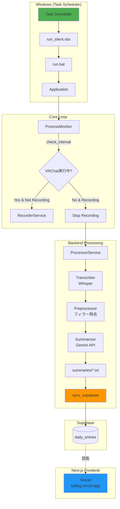
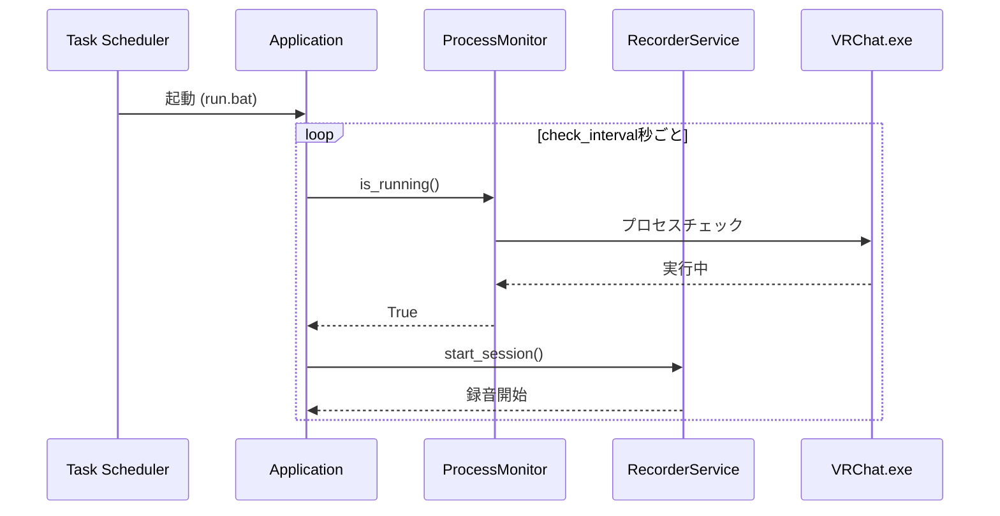
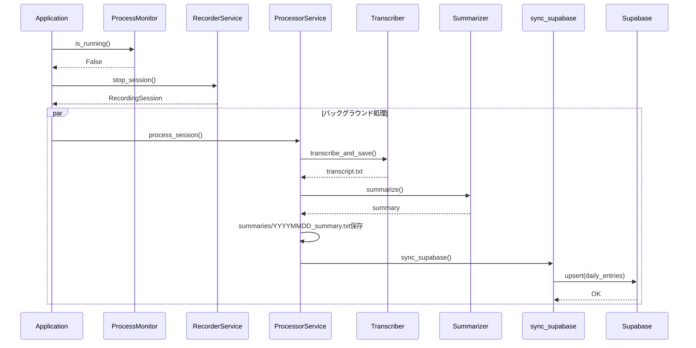
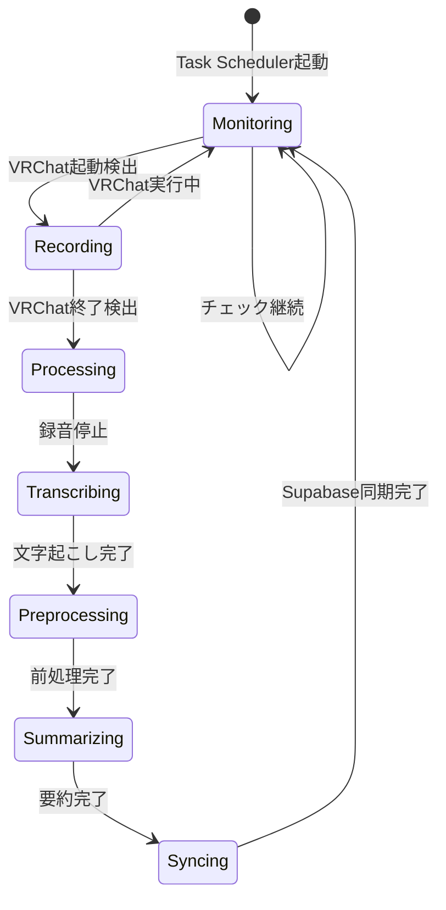
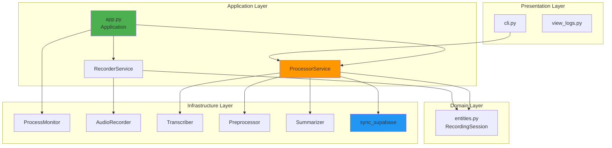
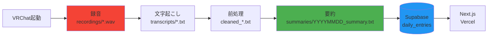

# VRChat Auto-Diary Architecture

## システム概要

VRChatプレイ中の音声を自動録音し、AIで文字起こし・要約して日記化するシステム。

## アーキテクチャ図

## シーケンス図

### VRChat起動時

### VRChat終了時

## 状態遷移図

## コンポーネント構成

## データフロー

## 自動化範囲

| コンポーネント | 自動化 | トリガー |
|---|---|---|
| VRChat監視 | ✅ | Task Scheduler起動時 |
| 録音開始/停止 | ✅ | VRChat起動/終了検出 |
| 文字起こし | ✅ | 録音終了時 |
| 前処理 | ✅ | 文字起こし完了時 |
| 要約生成 | ✅ | 前処理完了時 |
| Supabase同期 | ✅ | 要約完了時 |
| Next.js開発 | ❌ | `task reader:dev` |
| Vercelデプロイ | ❌ | `task reader:deploy` |
