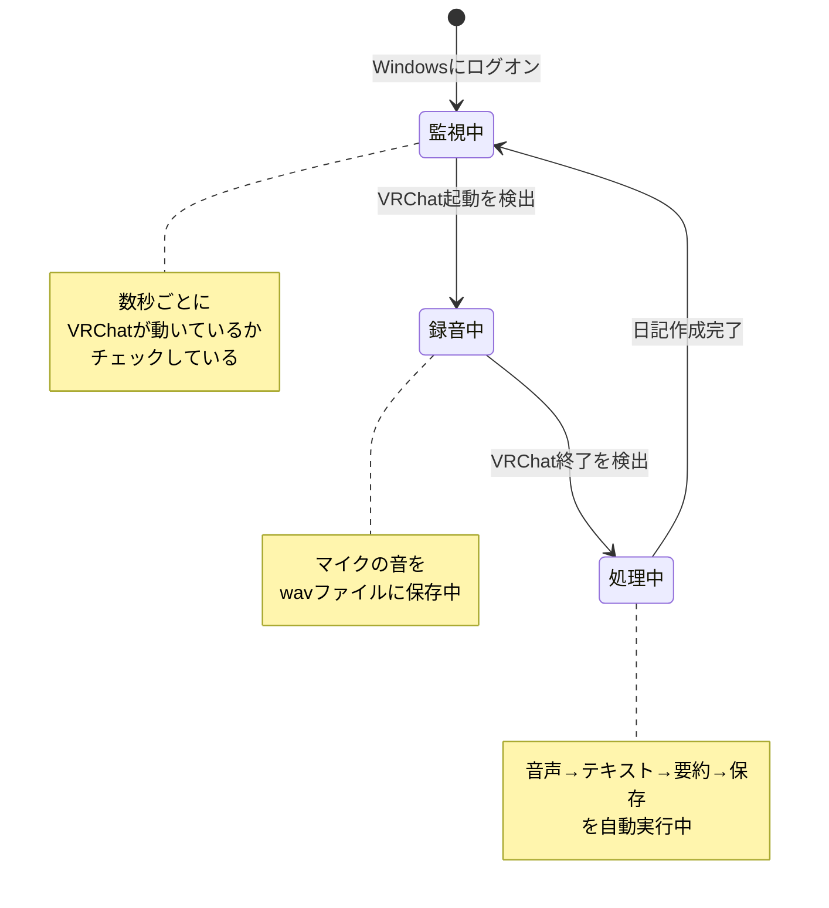
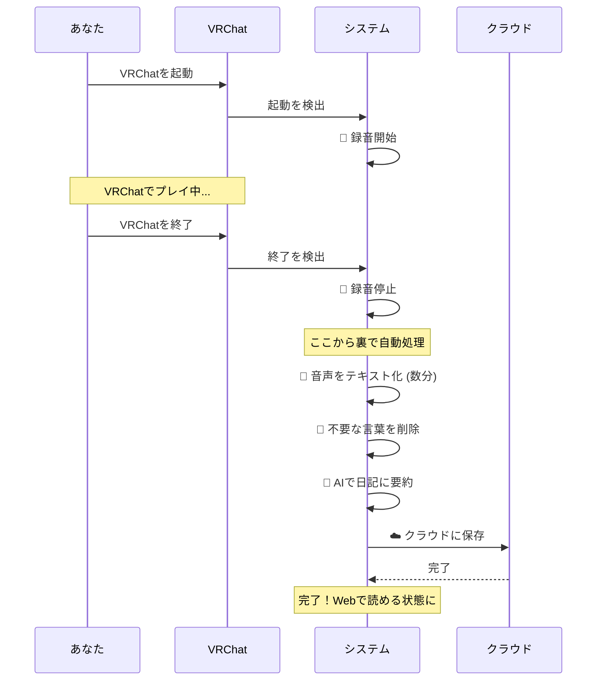

# VRChat Auto-Diary システム構成図

このシステムがどのように動いているかを図で説明します。

---

## ① 全体の流れ（データフロー図）

**この図は何？**: あなたがVRChatで遊んだ音声が、最終的にWebサイトで読める日記になるまでの流れを表しています。


**実際の体験で言うと**:

1. VRChatを起動すると、自動で録音開始
2. VRChatを終了すると、録音停止
3. 裏で自動的に音声がテキストに変換される
4. AIが日記形式に要約してくれる
5. クラウド（Supabase）に保存される
6. Webサイトで読める

---

## ② VRChat起動・終了の監視（状態遷移図）

**この図は何？**: システムが「VRChatが起動したか？」「終了したか？」を常に監視して、状態を切り替えている様子です。



**実際の体験で言うと**:

- **監視中**: 何もしていない。VRChatの起動を待っている
- **録音中**: VRChatでプレイ中。裏で録音している
- **処理中**: VRChatを終了した後、裏で日記を作っている（数分かかる）

---

## ③ VRChat終了後の自動処理（シーケンス図）

**この図は何？**: VRChatを終了した後、裏で何が起きているかを時系列で表しています。



**実際の体験で言うと**:

1. あなたがVRChatを終了
2. システムが録音を止める
3. その後は自動で処理（5〜10分くらい）
4. 完了したら、Webサイトで日記が読める状態に

---

## 自動/手動の区別

| やること | 自動？ | いつ動く？ |
|---|:---:|---|
| 📌 VRChatの監視 | ✅ 完全自動 | Windowsログオン時から常に |
| 🎤 録音の開始/停止 | ✅ 完全自動 | VRChat起動/終了を検出したら |
| 📝 音声→テキスト | ✅ 完全自動 | 録音が終わったら |
| 🤖 テキスト→日記 | ✅ 完全自動 | テキスト化が終わったら |
| ☁️ クラウド保存 | ✅ 完全自動 | 日記作成が終わったら |
| 🌐 Webサイト更新 | ❌ 手動 | 開発者が`task web:deploy`を実行 |

**つまり**: VRChatで遊ぶだけで、日記が勝手にできあがる！

---

## ファイルの置き場所

```bash
vlog/
data/
  ├── recordings/     🎤 録音ファイル (flac形式)
  ├── transcripts/    📝 音声から変換したテキスト
  └── summaries/      ✨ AIが作った日記
logs/
  └── vlog.log        📋 システムの動作記録
```

**トラブル確認方法**: WSLで`task status`を実行すると、今何をしているかがわかります。
