# 画像生成サブシステム詳細仕様書 (Image Generation Subsystem Internal Specification)

> マスタードキュメント → [docs/overview.md](file:///home/kafka/projects/vlog/docs/overview.md)  
> 開発ガイド → [AGENTS.md](file:///home/kafka/projects/vlog/AGENTS.md)

このドキュメントは、Vlogプロジェクトにおける画像生成サブシステム（Image Generation Subsystem）の技術仕様、アーキテクチャ、運用、およびトラブルシューティングに関する包括的なリファレンスです。開発者および運用者が、本システムの内部動作を完全に理解し、カスタマイズやデバッグを行えるレベルの詳細度を目指して記述されています。

## 目次

1. [システム概要](#システム概要)
2. [技術アーキテクチャ](#技術アーキテクチャ)
3. [詳細処理フロー（フローチャート・シーケンス）](#詳細処理フロー)
4. [プロンプトエンジニアリング戦略](#プロンプトエンジニアリング戦略)
5. [設定パラメータ完全リファレンス](#設定パラメータ完全リファレンス)
6. [データモデルとディレクトリ構造](#データモデルとディレクトリ構造)
7. [使用モデル詳細](#使用モデル詳細)
8. [手動操作とCLIツール](#手動操作とCLIツール)
9. [トラブルシューティングとFAQ](#トラブルシューティングとfaq)

---

## 1. システム概要

Vlogの画像生成サブシステムは、日々の活動ログ（音声認識→要約→小説化）の最終工程として機能し、その日の出来事や感情を視覚的に表現するデジタルアートを生成します。

本システムの中核思想は「**物語の文脈を汲み取った高品質なアニメ調イラストの自動生成**」です。単なるキーワード検索ではなく、LLM（Large Language Model）を用いて小説の文章から「視覚的に映える要素」を抽出し、それを画像生成AI（Diffusion Model）が解釈しやすい「Danbooruタグ形式」に変換することで、一貫性と美観を兼ね備えた画像を生成します。

---

## 2. 技術アーキテクチャ

本システムは、以下の主要コンポーネントとライブラリ群によって構成されています。

### 2.1 コンポーネント構成

- **Orchestrator**: `BuildNovelUseCase` (`src/use_cases/build_novel.py`)
    - プロセス全体の指揮者。小説生成完了をトリガーとして画像生成を開始します。
- **Core Generator**: `ImageGenerator` (`src/infrastructure/ai.py`)
    - 画像生成ロジックの本体。プロンプト構築、モデルロード、推論実行、ファイル保存を一元管理します。
- **Prompt Engineer**: `JulesClient` (`src/infrastructure/ai.py`)
    - Google Gemini APIへのインターフェース。「アートディレクター」としての役割を持ち、自然言語の小説を画像生成タグへ変換します。
- **Inference Engine**: `Hugging Face Diffusers`
    - 最先端の拡散モデルを使用するためのライブラリ。PyTorchバックエンド上で動作し、CUDA（NVIDIA GPU）アクセラレーションを活用します。

### 2.2 依存ライブラリとバージョン要件

- **Python**: 3.11+
- **Torch**: 2.5.1+ (CUDA 12.x 対応必須)
- **Diffusers**: 最新版 (Gitベース推奨)
- **Transformers**: 4.46.3+ (CLIP Text Encoder等に使用)
- **Accelerate**: 1.1.1+ (GPUメモリ最適化、モデルオフロード)
- **Google Generative AI**: 0.8.0+ (Gemini APIクライアント)

---

## 3. 詳細処理フロー

画像生成は以下の厳密なパイプラインに従って実行されます。

```mermaid
sequenceDiagram
    participant Orchestrator as BuildNovelUseCase
    participant Generator as ImageGenerator
    participant LLM as JulesClient (Gemini)
    participant Pipeline as StableDiffusionPipeline

    Note over Orchestrator: 小説生成完了通知
    Orchestrator->>Generator: generate_from_novel(full_text, output_path)
    
    rect rgb(20, 20, 40)
        Note right of Generator: Phase 1: Context Analysis
        Generator->>LLM: generate_image_prompt(full_text)
        LLM->>LLM: Analyze Context & Mood
        LLM->>LLM: Extract Visual Elements
        LLM->>LLM: Convert to Tags
        LLM-->>Generator: return "1girl, library, sunset..."
    end

    rect rgb(40, 40, 20)
        Note right of Generator: Phase 2: Prompt Engineering
        Generator->>Generator: Remove Ban-words (pig, etc...)
        Generator->>Generator: Apply Quality Template
        Generator->>Generator: Load Negative Prompt
    end

    rect rgb(20, 40, 20)
        Note right of Generator: Phase 3: Generation (Inference)
        Generator->>Pipeline: Check Model Cache / Load Model
        Pipeline->>Pipeline: Move to CUDA
        Generator->>Pipeline: __call__(prompt, neg_prompt, ...)
        
        loop Denoising Steps (Example: 28 steps)
            Pipeline->>Pipeline: UNet Prediction
            Pipeline->>Pipeline: Scheduler Step
        end
        
        Pipeline-->>Generator: return PIL.Image
    end

    rect rgb(40, 20, 20)
        Note right of Generator: Phase 4: Persistence
        Generator->>Generator: Save Image (PNG)
        Generator->>Generator: Save Prompt Log (TXT)
    end
```



### 3.1 Phase 1: Context Analysis (文脈解析)
小説の全文（最大トークン数に注意）を `JulesClient` に渡します。
プロンプト設定 (`data/prompts.yaml`) に基づき、LLMは以下の要素を抽出・推論します。
- **キャラクター**: 外見、服装、ポーズ、表情 (例: `silver hair, school uniform, reading book, smile`)
- **場所・環境**: 屋内/屋外、場所の種類、時間帯、天候 (例: `library, indoors, sunset, light rays`)
- **雰囲気**: 色調、照明効果 (例: `warm lighting, cinematic composition`)

### 3.2 Phase 2: Prompt Engineering (プロンプト構築)
LLMから返された生のタグに対し、以下の処理を行い、最終的なプロンプトを完成させます。
1. **禁止語フィルタリング**: 特定の不要な語句（例：豚肉関連など、文脈によって誤爆しやすい単語）を正規表現で削除。
2. **テンプレート適用**: `(masterpiece), (best quality), (very aesthetic), (absurdres)` などの高品質化タグを先頭に付与。
3. **セーフティタグ**: `(rating:safe)` を末尾に付与し、NSFWコンテンツの生成を抑制。

### 3.3 Phase 3: Generation (推論実行)
組み立てられたプロンプトと、固定のネガティブプロンプトを用いて画像生成を実行します。
プロセスは GPU (CUDA) 上で行われ、`float16` または `bfloat16` 精度で計算されます。

**実装詳細 (Code Path)**:
- **ファイル**: [`src/infrastructure/ai.py`](file:///home/kafka/projects/vlog/src/infrastructure/ai.py)
- **クラス**: `ImageGenerator`
- **メソッド**: `generate`
- **実行箇所**: 
  - `self._pipe(...)` の呼び出しにより、`diffusers.DiffusionPipeline` の `__call__` メソッドが実行されます。
  - 内部的には `StableDiffusionXLPipeline` (またはロードされたモデルのパイプライン) が推論ループを回します。

---

## 4. プロンプトエンジニアリング戦略

本システムでは、Animagine XL 3.1 の特性を最大限に引き出すため、**Danbooruタグ形式** を採用しています。自然言語の文章よりも、タグの羅列の方が拡散モデルへの指示として明確であり、意図しない解釈ブレを防ぐことができます。

### 4.1 プロンプトテンプレート構造 (`data/prompts.yaml`)

```yaml
image_generator:
  template: |
    (masterpiece), (best quality), (very aesthetic), (absurdres),
    {text},  <-- ここにLLMが抽出したタグが挿入される
    (rating:safe)
```

- **(masterpiece), (best quality)**: 最も基本的な品質向上タグ。これがないと作画が崩れやすい。
- **(absurdres)**: "Absurd Resolution"の略。高解像度で緻密な書き込みを誘導する。
- **(very aesthetic)**: 審美的に優れた構図や色使いを誘導するAnimagine特有のタグ。

### 4.2 ネガティブプロンプトの役割

品質を下げる要素を否定することで、相対的にクオリティを底上げします。

```yaml
negative_prompt: |
  (worst quality, low quality:1.4), (grayscale), (western face), (3d render),
  (sketch), (painting), (anime), (cartoon), (american style),
  ... (四肢欠損や指の数を修正するタグ群) ...
```

特に `(low quality:1.4)` のように重み付けを行うことで、低品質な出力を強力に抑制しています。

---

## 5. 設定パラメータ完全リファレンス

すべての設定は `src/infrastructure/settings.py` および `config.yaml` で管理されています。

| パラメータ名 | 設定キー (config.yaml) | デフォルト値 | 説明・影響 |
|---|---|---|---|
| **Model ID** | `image.model` | `cagliostrolab/animagine-xl-3.1` | HuggingFace上のモデルID。アニメ調生成においてSOTA級の性能を持つSDXLモデル。 |
| **Device** | `image.device` | `cuda` | 計算デバイス。`cpu` では実用的な速度が出ないため `cuda` 推奨。 |
| **Width** | `image.width` | `1024` | 生成画像の幅。SDXLは1024x1024で学習されているため、このサイズが最適。 |
| **Height** | `image.height` | `1024` | 生成画像の高さ。 |
| **Steps** | `image.num_inference_steps` | `28` | ノイズ除去のステップ数。多いほど精緻になるが時間がかかる。28～30が品質と速度のバランスが良い。 |
| **Guidance Scale** | `image.guidance_scale` | `7.0` | プロンプトへの忠実度（CFG Scale）。高いほどプロンプトに従うが、高すぎると絵が破綻する。7.0は標準的な値。 |
| **Seed** | `image.seed` | `42` | 乱数シード。固定すると同じプロンプトから同じ画像が出る。現在の実装では、ランダム生成時にオーバーライドされることが多い。 |

---

## 6. データモデルとディレクトリ構造

生成されたアセットは以下の構造で保存・管理されます。

### 6.1 ファイルシステム

```
data/
├── photos/                  # 生成された画像ファイル
│   ├── 20251201.png
│   ├── 20251202.png
│   └── ...
└── photos_prompts/          # 生成時のプロンプトログ（デバッグ・再現用）
    ├── 20251201.txt
    ├── 20251202.txt
    └── ...
```

### 6.2 データベース (Supabase)

生成された画像のパスやメタデータは、`novels` テーブルに紐付けられます。

- **Table**: `novels`
    - `image_url`: 生成された画像のストレージパス（例: `/photos/20251201.png`）

---

## 7. 使用モデル詳細

本システムでは2つのモデルが設定可能です。**環境に応じて適切なモデルを選択してください。**

### 7.0 モデル選択ガイド

| モデル | Model ID | パラメータ数 | 推奨VRAM | 最小VRAM | 推奨ステップ |
|---|---|---|---|---|---|
| **Animagine XL 3.1** | `cagliostrolab/animagine-xl-3.1` | ~3.5B (SDXL全体) | 12GB | 8GB | 28 |
| **Z-Image-Turbo** | `Tongyi-MAI/Z-Image-Turbo` | ~6B | 16GB | 6GB | 8-10 |

※ Animagine XL 3.1のパラメータ数: SDXLPipeline全体（Text Encoder等含む）で約3.5B相当。UNet単体は約2.6Bです。

> [!CAUTION]
> **Z-Image-Turbo使用時の注意点**:  
> - **推奨環境**: VRAM 16GB以上のGPU、1024x1024的生成向け
> - **最小環境について**: 上記の6GBは量子化（GGUF等）やCPUオフロードなど非公式な最適化を行った場合の目安です。公式Diffusers構成での安定動作は保証されません。
> - **Exit 137 (OOM Killer)のリスク**: Qwen3系テキストエンコーダ（4Bクラス）を使用するため、CLIP系よりSystem RAM消費が大きくなります。特にVRAM不足時にCPUオフロードが発生すると、16GB RAM環境ではOOMになり得ます（実例あり）。
> - **CPUオフロードを許容する運用では、System RAM 32GB以上が望ましいです。**

### 7.1 現在の設定 (Z-Image-Turbo)

`data/config.yaml` の設定により、現在は **Tongyi-MAI/Z-Image-Turbo** が設定されています。

- **モデルID**: `Tongyi-MAI/Z-Image-Turbo`
- **物理パス (Shared Path)**: 
  - `~/.cache/huggingface/hub/models--Tongyi-MAI--Z-Image-Turbo`
  - (Windowsの場合: `%USERPROFILE%\.cache\huggingface\hub\models--Tongyi-MAI--Z-Image-Turbo`)
- **特徴**:
  - SDXLベースの高速蒸留モデル（Turbo）
  - 少ないステップ数（8-10ステップ）で高品質な描画が可能
  - **Qwen3テキストエンコーダー搭載（巨大）**

### 7.2 代替モデル (Animagine XL 3.1)

**RAM 16GB以下の環境**では、`settings.py` のデフォルトである **Animagine XL 3.1** を使用してください。

- **モデルID**: `cagliostrolab/animagine-xl-3.1`
- **特徴**:
  - 標準的なCLIPテキストエンコーダー（軽量）
  - Danbooruタグに対する理解度が高い
  - 一般的なワークステーション（16GB RAM, 8GB VRAM）で動作

**設定変更方法** (`data/config.yaml`):
```yaml
image:
  model: "cagliostrolab/animagine-xl-3.1"  # Z-Image-Turboから変更
  num_inference_steps: 28  # Animagineは28ステップ推奨
  guidance_scale: 7.0      # CFG Scaleを適切に設定
```

### 7.3 物理ディレクトリ構造とSnapshot (Physical Structure)

Hugging Faceのモデルは、`snapshots` ディレクトリ以下にハッシュID（Git Commit Hash）でバージョン管理されています。直接パスを参照する場合は、最新のsnapshotディレクトリを指定する必要があります。

**ディレクトリ構成**:
```text
~/.cache/huggingface/hub/models--Tongyi-MAI--Z-Image-Turbo/
├── blobs/                  # 実体ファイル（LFS object）
├── refs/                   # ブランチ参照
└── snapshots/              # リビジョンごとのディレクトリ
    ├── 5f4b9cbb80cc95ba44fe6667dfd75710f7db2947/
    └── 78771b7e11b922c868dd766476bda1f4fc6bfc96/  <-- (例) 最新のリビジョン
            ├── model_index.json
            ├── scheduler/
            ├── text_encoder/
            ├── text_encoder_2/
            ├── tokenizer/
            ├── tokenizer_2/
            ├── unet/
            └── vae/
```

> [!WARNING]
> **スナップショットIDについて**:  
> 上記のハッシュID（`78771b7e...` 等）はモデルの更新により変更される可能性があります。
> `scripts/generate_image_local.py` 等でパスをハードコードする場合は、`ls` コマンドで実際に存在するディレクトリを確認してください。
> 
> **確認コマンド**:
> ```bash
> ls -F ~/.cache/huggingface/hub/models--Tongyi-MAI--Z-Image-Turbo/snapshots/
> ```

実装においては、`Diffusers` ライブラリが自動的に `refs/main` を参照して最新のスナップショットを解決するため、通常は `Tongyi-MAI/Z-Image-Turbo` というモデルID指定だけで動作します。オフライン環境や物理パスを直接マウントする場合のみ、このスナップショット構造を意識する必要があります。

---

## 8. 手動操作とCLIツール

システム運用において、特定の小説に対して画像を再生成したい場合や、プロンプトのテストを行いたい場合は、以下のCLIツールを使用します。

### 8.1 汎用画像生成スクリプト

`scripts/generate_image.py` は、任意のテキスト入力から画像を生成できる強力なツールです。

**使用法**:
```bash
# 基本的な使用法
uv run python scripts/generate_image.py "テキストプロンプト" 出力パス.png

# ファイル入力モード（推奨：長い文章の場合）
uv run python scripts/generate_image.py data/novels/20251201.md test_output.png
```

このスクリプトは、本番環境の `ImageGenerator` クラスをそのままインポートして使用するため、生成される画像の品質や傾向は本番と完全に一致します。

### 8.2 ヘッダー画像合成スクリプト

Note.com等の記事ヘッダー用に、複数の画像を組み合わせて1枚の大きな画像 (1280x670) を作成します。

**使用法**:
```bash
# 2〜4枚の画像を合成して保存
uv run python scripts/create_composite_header.py data/photos/img1.png data/photos/img2.png --output articles/note_images/header.png
```
- 入力枚数に応じて自動的にレイアウトが調整されます（全画面、左右分割、3列、4分割グリッド）。


---

## 9. トラブルシューティングとFAQ

### Q1. "CUDA out of memory" エラーが発生する

**原因**: GPUのVRAM不足です。SDXLモデルは大きく、フル精度でロードするには約16GB以上のVRAMが推奨されます。
**対策**:
1. `src/infrastructure/ai.py` の `DiffusionPipeline.from_pretrained` で `torch_dtype=torch.float16` または `bfloat16` が指定されているか確認してください。
2. それでも足りない場合は、`enable_model_cpu_offload()` を追加して、使用していないモジュールをCPUに退避させる処理を検討してください（現在のコードには含まれていないため、要改修）。

### Q2. 生成された画像が崩れている（手や顔の崩壊）

**原因**: 拡散モデル特有の現象です。特に複雑なポーズや多人数を描写する場合に発生しやすくなります。
**対策**:
1. ネガティブプロンプトを強化する。現在の `bad anatomy`, `extra digits` などを確認。
2. 解像度をSDXLネイティブの `1024x1024` に保つ。これ以外の比率（特に低解像度）では品質が著しく低下します。
3. Prompt Engineeringで `simple background` を指定して、主題に計算リソースを集中させる。

### Q3. 生成が極端に遅い

**原因**: GPUが認識されず、CPUで推論している可能性があります。
**対策**:
1. ターミナルで `nvidia-smi` を実行し、GPUの状態を確認。
2. `settings.py` の `image_device` が `cuda` になっているか確認。
3. PyTorchがCUDA版でインストールされているか確認 (`uv pip list | grep torch`)。

### Q4. 全く関係ない画像が生成される

**原因**: LLMによるタグ抽出が失敗しているか、ハルシネーション（幻覚）を起こしています。
**対策**:
1. `data/photos_prompts/` 内のログファイルを確認し、実際にどのようなプロンプトが渡されたか確認する。
2. `data/prompts.yaml` の `jules.image_prompt` の指示を調整し、より具体的な抽出を行うよう修正する。

### Q5. "ValueError: Height must be divisible by 16" エラー

**原因**: 拡散モデルの構造上、画像サイズ（特に高さ・幅）は **8 または 16 の倍数** である必要があります。
**対策**:
- 出力サイズを調整してください（例: 402px → 400px）。


---

*Document Revision: 1.1.0*
*Last Updated: 2025-12*
