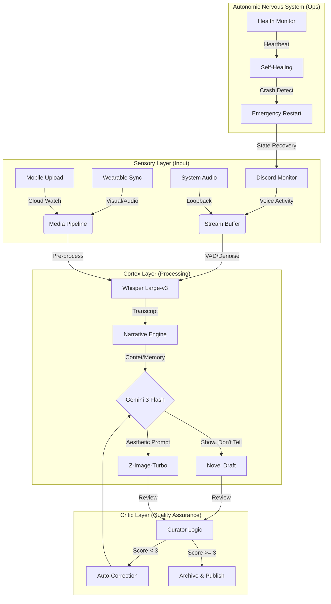

# 自律稼働ロードマップ：2026年02月18日（Total Master Roadmap）

本ドキュメントは、VLogシステムを **「神ごとき自律性（God-Like Autonomy）」** と **「絶対的な現実（Absolute Physical Reality）」** の両立へと導くための、最終的かつ包括的なマイルストーン定義書です。
これまでの全ユースケース、技術基準、品質指標を統合し、プロジェクトの「完成（Done）」を定義する唯一の真実（Single Source of Truth）とします。

## 1. Zero-Ops / Crash-Only Infrastructure (基盤の完全自律)

人間がシステムの「世話」をする必要を完全に排除し、電源が供給される限り永続的に稼働する生命体のようなインフラを構築します。

- [] **自律監視と自己修復**
    - [] `vlog-daily.service` および `vlog.service` が、OS起動と同時に100%確実に立ち上がること。
    - [] プロセスが予期せず終了（Crash/Kill）した場合、`systemd` が10秒以内に再起動し、直前のチェックポイント（30秒以内のロス）から処理を再開すること。
    - [] **メモリ自浄作用**: メモリ使用量が閾値（例: 80%）を超えた場合、安全なタイミングで自ら再起動し、リソースを開放すること（OOM Killer発動前の自衛）。

- [] **ACID準拠のデータ整合性**
    - [] 全てのファイル書き込み（録音、ログ、DB）に対し、`write -> fsync -> rename` パターンを徹底し、電源断によるデータ破損（torn writes）を物理的に防ぐこと。
    - [] 処理中のタスク（Pending）と完了したタスク（Done）の状態遷移が、不可分操作として管理されること。

- [] **Hardware-Aware Performance**
    - [] GPU (CUDA) と CPU の負荷を監視し、`Z-Image-Turbo` などの重い処理が、ユーザーのフォアグラウンド作業（ゲーム、ブラウジング）の FPS に 1% 以上の影響を与えないこと。

## 2. Narrative Engine & Quality Assurance (物語生成の極致)

単なるログではなく、読み手が感情移入できる「文学作品」としての品質を、AI自身が担保します。

- [] **Curator Logic の完全実装**
    - [] 全ての生成されたチャプターに対し、`prompts.yaml` 定義の `curator` が自動レビューを実行すること。
    - [] **正規分布スコアリング**: 評価が偏らず、厳格な基準（3:Standard, 4:Ecellent, 5:Masterpiece）に基づいてスコアリングされること。
    - [] **自動推敲ループ**: スコアが「2 (Below Average)」以下の場合、異なる温度パラメータ（Temperature）または視点を変えて再生成を試みる自己修正機能を備えること。

- [] **Absolute Physical Reality (脱バーチャル)**
    - [] **Keyword Filter**: `config.yaml` の `prompt_filters` を通過できない単語（VR, HMD, Avatar等）が含まれた場合、即座に棄却・再生成すること。
    - [] **Physical Grounding**: 「アバターの姿」ではなく「魂の形状」、「ワールドのポリゴン」ではなく「その場の空気感」として描写されていることを、embedding類似度判定などで保証すること。

- [] **Cinematic Visuals**
    - [] `Z-Image-Turbo` (Flow Matching) により、単なる説明図ではなく、映画のワンシーン（Golden Hour, Cinematic Lighting）のような情緒的価値のある挿絵を100%生成すること。
    - [] アスペクト比、解像度、構図が、VLog全体のトーン＆マナーと完全に一致していること。

## 3. Universal Input Integration (全感覚の統合)

あらゆるソースからの入力を、ひとつのタイムライン（物語）へと統合します。

- [] **Discord (The Social Layer)**
    - [] 起動を検知してから **10秒以内** に録音体制へ移行すること。
    - [] WER (Word Error Rate) **5.0%以下** の精度で、多話者・重複発話を分離して文字起こしできること。

- [ ] **VRChat / Desktop Audio (The Physical Layer)**
    - [ ] 環境音（BGM、SE）と音声を分離、あるいは適切なバランスでミックスし、「その場にいた」臨場感を再現すること。
    - [ ] 無音区間（Silence）を **99%の精度** で検出し、ストレージ容量とAPIコストを浪費しないこと。

- [] **Mobile & Wearable (The Etended Layer)**
    - [] クラウドストレージ（iCloud/Drive）へのファイル追加を **5秒以内** に検知する `File Watcher` の実装。
    - [] 異なるサンプリングレートやフォーマットの音声ファイルを、統一された `16kHz Mono` 規格へ自動正規化（Normalize）すること。

## 4. Definition of Done (完了の定義: チェックリスト)

このプロジェクトが「完成」したと宣言するための、最終的な合否判定リストです。

### System Stability
- [ ] 168時間（1週間）の連続稼働テストを、エラーログ出力なし（Warn以上なし）でクリアした。
- [ ] 意図的にプロセスを `kill` しても、データの欠損なく復旧することを確認した。

### Narrative Quality
- [ ] 直近100件の生成小説において、Curatorスコアの平均が **3.5以上** である。
- [ ] VR/メタバース用語の混入が **0件** である。

### User Eperience
- [ ] ユーザーが行う操作が「ただ生きること（Discordで話す、ゲームをする、出かける）」以外に **一切存在しない**。
- [ ] 生成された日報（HTML/Markdown）が、毎朝所定の時間に確実にデリバリーされている。

---
**Final Verdict**: 全てのチェックボックスが埋まった瞬間、VLogは「開発」を終え、「生活」の一部となります。

