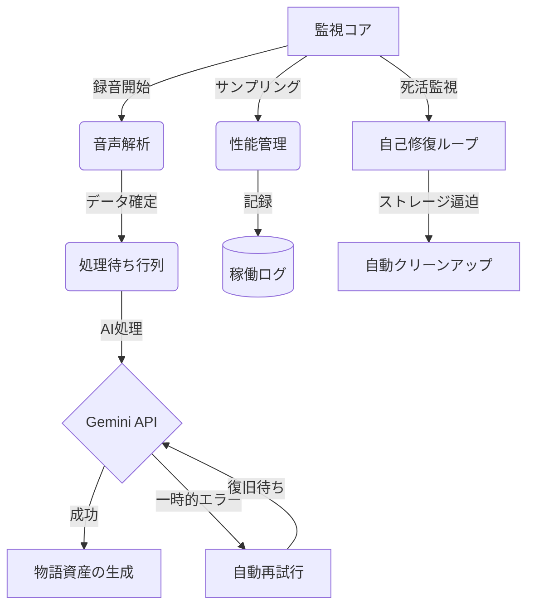

# 自律稼働ロードマップ：2026年02月18日

本ドキュメントは、VLogシステムを単なる「コードの集合体」から「自律稼働する製品」へと昇華させるための要件定義書です。技術的な詳細は背後に隠し、**「システムが何を実現し、どのような状態であれば完成と言えるのか」**を明確にします。

## 1. 止まらない・壊れない（稼働の継続性）

システムがユーザーの助けを借りずに動き続けるための基準です。

- [ ] **「健康状態」の自動モニタリング**
    - システムの負荷（CPU、メモリ使用量）を常時監視し、異常があればログに記録します。
    - **達成基準**: 監視そのものがPCの動作を重くしないこと（処理時間は1回10ms以内）。
- [ ] **アトミックなデータ保存**
    - 保存中にPCが落ちてもデータが壊れないよう、一時ファイルを作ってから一瞬で入れ替える方式を採用します。

## 2. 物語の品質を守る（処理精度と一貫性）

記録された「日常」を、質の高い「物語」として残し続けるための基準です。

- [ ] **耳の良さの自動判定 (Audio-QA)**
    - 録音された音声が正しく文字に起こせているかを自動でテストします。
    - **達成基準**: 静かな場所なら97%以上、騒がしい場所でも88%以上の正確さを維持すること。

## 3. 手間をかけさせない（自動化と運用）

設定や確認の作業を極限まで減らし、放置していても状況がわかるようにします。

- [ ] **コマンド一つで現在の状況を把握**
    - `vlog-status` と打つだけで、ここ24時間の稼働時間や、処理が終わっていないデータの数が一目でわかる仕組みを作ります。
- [ ] **最初の一歩を自動化するセットアップ**
    - `cargo run -- setup` で、必要なフォルダの作成からマイクの設定までを対話形式で完結させます。
