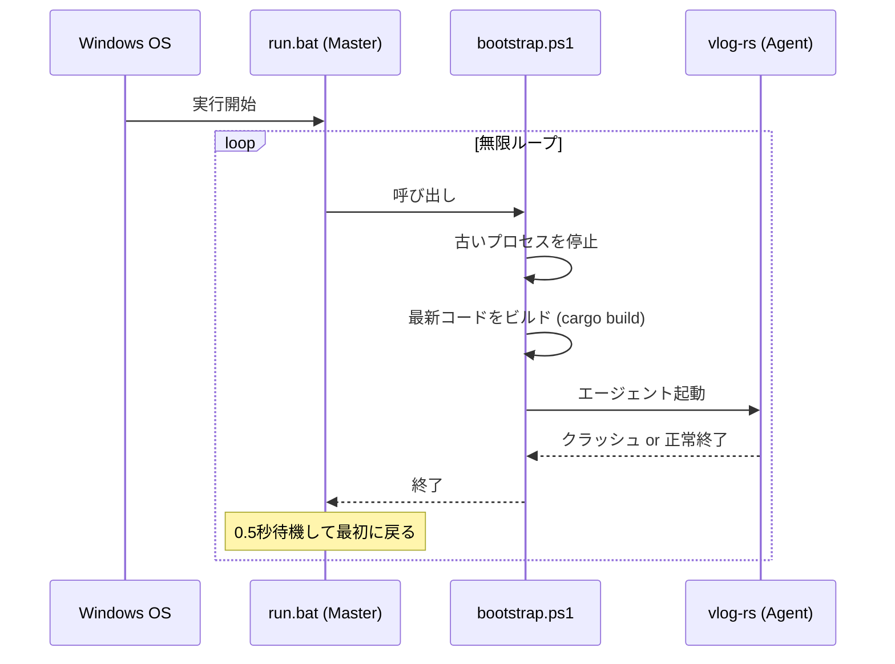
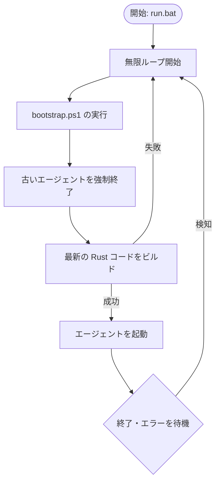

# Zero-Ops Autopilot プロトコル

**Zero-Ops Autopilot** は、ユーザーの手を借りずに（手動の再起動なしで）、遠隔からエージェントを更新・管理するための仕組みです。

## 概要

このシステムは、Windows OS 上で入れ子になった「3層のループ構造」で動いています。

1.  **run.bat (最外周)**: 全体の監視と自動再起動。
2.  **bootstrap.ps1 (準備層)**: 最新コードのビルドと環境整備。
3.  **vlog-rs (実行層)**: 実際のエージェント動作。

## 処理の流れ (シーケンス図)

エージェントがクラッシュしたり、コードが更新されたりしたときの挙動です。

## 制御ロジック (フロー図)

システムがどのように自己修復し、更新を取り込むかを示します。

## メリット

-   **止まらない遠隔開発**: 開発者が WSL 上で Rust コードを書き換えると、Windows 側のエージェントが自動でビルド・再起動し、即座に反映されます。
-   **自己修復**: もしビルドエラーやクラッシュが起きても、ループが自動でリトライし続け、修正されると自動で復旧します。
-   **スクリプト自身の更新**: `run.bat` が `bootstrap.ps1` を毎回呼び出すため、運用スクリプト自体の変更も即座に適用されます。

## 運用方法

-   **開始**: `windows/run.bat` を 1 回実行するだけ。
-   **停止**: コマンドプロンプトを閉じる。
-   **更新**: `src/` などのコードを保存するだけ。あとは全自動です。
