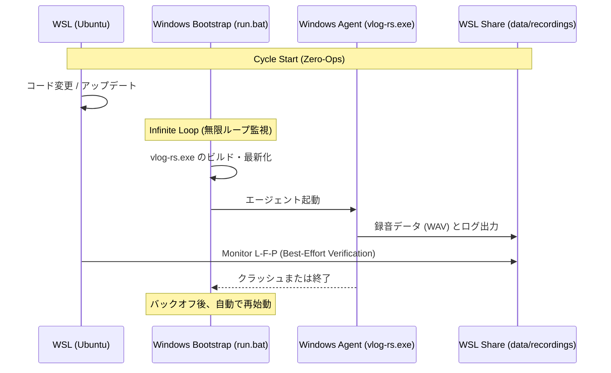
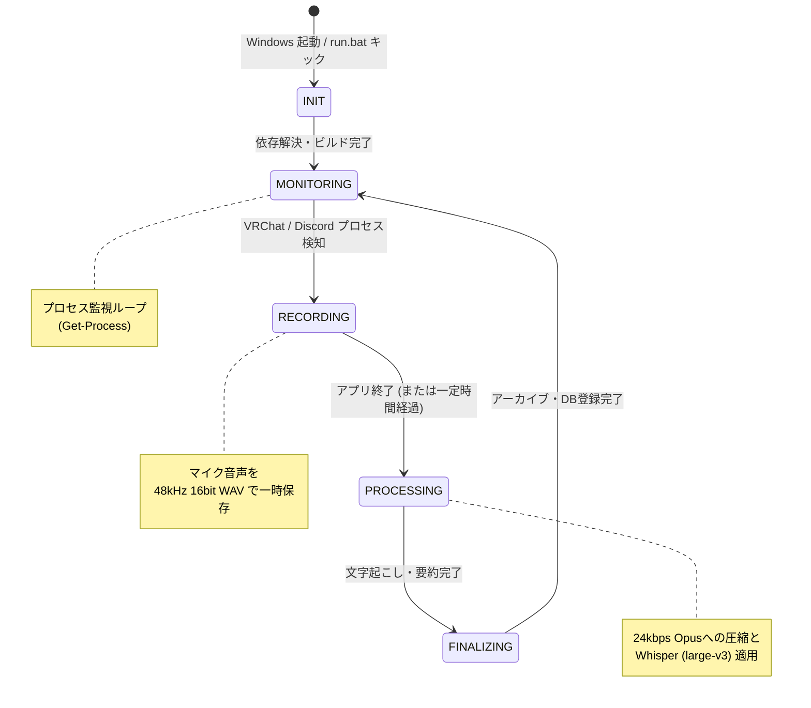

# VRChat Auto-Diary (VLog) システム構成図

> マスタードキュメント → [docs/overview.md](file:///home/kafka/vlog/docs/overview.md)  
> 開発プロトコル → [vlog.md](file:///home/kafka/vlog/.agent/workflows/vlog.md)

このシステムがどのように動いているかを図で説明します。現在の構成は「Rust」と「Zero-Ops Autopilot」仕様に基づいています。

---

## ① 全体の流れ（Zero-Ops Architecture）

**この図は何？**: あなたがVRChatやDiscordで遊んだ音声が、最終的に日記（Journal）になるまでの全体の流れを表しています。

```mermaid
graph LR
    subgraph "Windows (Sensor / Agent)"
        WA[vlog-rs.exe Monitor] -->|録音: 48kHz WAV| SMB[WSL2 Share]
        WA -->|ログ・状態検知| SMB
        
        note1["VRChat.exe / Discord.exe<br>起動監視"] -.-> WA
    end
    
    subgraph "Ubuntu (Process / Processor)"
        SMB -->|Inotify (検知)| WM[vlog-rs Monitor]
        WM -->|変換 (Opus 24kbps)| DB[(SQLite vlog.db)]
        WM -->|文字起こし (Whisper)| DB
        
        DB -->|Retrieve| GE[Gemini 3 Flash]
        GE --> JN[Journal 生成]
    end

    style WA fill:#00BCD4,color:#000
    style WM fill:#4CAF50,color:#fff
    style DB fill:#FF9800,color:#000
    style GE fill:#9C27B0,color:#fff
```

**実際の体験で言うと**:
1. VRChat（またはDiscord）を起動すると、Windows側の `vlog-rs.exe` が自動で感知して録音を開始します（WAV形式）。
2. Ubuntu（WSL）側の `vlog-rs monitor` がファイル生成を検知し、裏で処理を開始します。
3. 音声をOpus（軽量形式）に圧縮し、SQLite（`vlog.db`）に記録します。
4. Whisperで文字起こしを行い、Gemini 3 Flash を使って日記（Journal）に変換します。
5. あなたはただ遊ぶだけで、何も操作する必要はありません（Zero-Ops）。

---

## ② Zero-Ops ライフサイクル (状態と自動復旧)

**この図は何？**: Windows側でどのように安定動作を維持しているか（完全自律復旧）を示しています。



---

## ③ VRChat起動・終了の監視（状態遷移図）

**この図は何？**: システムが「対象アプリが起動したか？」「終了したか？」を監視して、状態を切り替えている様子です。



---

## ④ 自動/手動の区別

| やること | 自動？ | いつ動く？ |
|---|:---:|---|
| 🔄 System Update | ✅ 完全自動 | WSLでコードが変更された次のループ時 |
| 📌 プロセス監視 | ✅ 完全自動 | `run.bat` が起動している限り常に |
| 🎤 録音の開始/停止 | ✅ 完全自動 | VRChat / Discord のプロセスを検知したら |
| 📝 音声の圧縮/文字起こし | ✅ 完全自動 | WSL側のモニターがWAVを検知したら |
| 🤖 テキスト→日記 (Journal) | ✅ 完全自動 | 処理キューにタスクが積まれたら |
| 📦 録音アーカイブ (DB) | ✅ 完全自動 | 処理が完了したら |

**つまり**: VRChatやDiscordで遊ぶだけで、最新のコードで勝手に日記ができあがります。Windows側でエラーが起きても `run.bat` が10秒以内に自動復旧（Self-Healing）させます。

---

## ⑤ ファイルとディレクトリ構造

システムは以下のディレクトリで構築されています。

```bash
vlog/
├── data/
│   ├── vlog.db         🛢️ メインデータベース (SQLite)
│   ├── config.yaml     ⚙️ 設定ファイル
│   └── recordings/     🎤 録音ファイル (一時的にWAV、最終的にOpus)
├── logs/
│   ├── vlog.log.*      📋 WSL用/全体システムの動作記録
│   └── windows-rust-monitor.log 📋 Windows側のL-F-P監視用ログ
├── windows/
│   ├── run.bat         🚀 エントリ・無限ループスクリプト
│   └── bootstrap.ps1   🔧 Windows側ビルド＆プロビジョニング
└── src/                🦀 Rust システム本体 (`vlog-rs`)
```

**トラブル確認方法 (多角的側面チェック: L-F-P)**:
直接Windowsを見に行かなくても、WSL側から以下の3点を確認します：
1. **L (Log)**: `logs/windows-rust-monitor.log` や `logs/vlog.log.*` に `Recording started` などのログがあるか？
2. **F (File)**: `data/recordings/` にファイルが増えているか？
3. **P (Process)**: `powershell.exe -Command "Get-Process vlog-rs"` でCPU使用率が0%超か？

---

## ⑥ 技術スタック (Iron Rules 準拠)

- **言語**: Rust (`vlog-rs`、Crash-Only パターンで panic 優先)
- **監視・起動**: Windows Batch (`run.bat`) + PowerShell (`bootstrap.ps1`)
- **データベース**: SQLite (`vlog.db` / WALモード)
- **音声処理**: 48kHz/16bit WAV → FFmpeg → 24kbps Opus
- **LLM**: Gemini 3 Flash (Primary)
- **音声認識**: Whisper (`large-v3/ja/vad_filter=true`)
- **デプロイ・タスク**: `just` (Task runner)

※ 新機能や修正を行う際は必ず `/vlog` および `/git` ワークフローに従って検証とコミットを実施してください。
