# 画像生成サブシステム詳細仕様書 (Image Generation Subsystem Internal Specification)

> マスタードキュメント → [docs/overview.md](file:///home/kafka/projects/vlog/docs/overview.md)  
> 開発ガイド → [AGENTS.md](file:///home/kafka/projects/vlog/AGENTS.md)

このドキュメントは、Vlogプロジェクトにおける画像生成サブシステム（Image Generation Subsystem）の技術仕様、アーキテクチャ、運用、およびトラブルシューティングに関する包括的なリファレンスです。

## 目次

1. [システム概要](#システム概要)
2. [技術アーキテクチャ](#技術アーキテクチャ)
3. [詳細処理フロー](#詳細処理フロー)
4. [プロンプトエンジニアリング戦略](#プロンプトエンジニアリング戦略)
5. [設定パラメータリファレンス](#設定パラメータリファレンス)
6. [データモデルとディレクトリ構造](#データモデルとディレクトリ構造)
7. [使用モデル詳細](#使用モデル詳細)
8. [手動操作とCLIツール](#手動操作とcliツール)
9. [トラブルシューティングとFAQ](#トラブルシューティングとfaq)

---

## 1. システム概要

Vlogの画像生成サブシステムは、日々の活動ログ（音声認識→要約→小説化）の最終工程として機能し、その日の出来事や感情を視覚的に表現するデジタルアートを生成します。

本システムの設計思想は「物語の文脈を汲み取った高品質イラストの自動生成」です。LLM（Gemini 3 Flash）を用いて小説の文章から「視覚的に映える要素」を自然言語で抽出し、それを最新の画像生成AI（Z-Image-Turbo）に渡すことで、一貫性と美観を兼ね備えた画像を生成します。

---

## 2. 戦略的設計意図 (Strategic Rationale)

なぜこの構成なのか、その意図とトレードオフを解説します。

### 2.1 Z-Image-Turbo の採用理由 (Speed vs Consistency)
- **理由**: 日次バッチ処理において、画像生成は最も時間のかかる工程です。SDXL（約30-50ステップ）と比較して、Z-Image-Turbo（9ステップ）は数倍高速です。これにより、ユーザー（あなた）がプロセス完了を待つストレスを最小限に抑えます。
- **トレードオフ**: Turbo系モデルはCFG Scaleが効かないため、細かいプロンプト追従性（Prompt Adherence）が若干劣る場合がありますが、Vlogの用途（雰囲気の再現）では許容範囲内と判断しました。

### 2.2 自然言語プロンプティング (Jules as Art Director)
- **理由**: 「高品質, 傑作...」といった呪文（Danbooruタグ）の羅列は、モデルの学習データ依存度が高く、シーンの文脈を反映しにくい問題がありました。
- **戦略**: Gemini 3 Flash（Jules）に「アートディレクター」という役割を与え、小説の文脈を解釈した上で、自然な英語の文章でシーンを記述させることで、より文学的で情緒的な出力を狙っています。

### 2.3 設定ベースのフィルタリング
- **理由**: モデルの特性上、特定の単語（例: `translucent`）で意図しないアーティファクトが発生することがあります。これらをコードにハードコードすると、モデル変更時に柔軟に対応できません。
- **解決策**: `config.yaml` に正規表現リストとして外出しすることで、コードを変更せずにモデルごとの「癖」を補正できるようにしました。

### 2.4 "Physical Reality" & Object Hygiene
- **ポリシー**: VRChatログをソースとしていますが、画像として出力する際は「HMD」「コントローラー」「VR機器」を**徹底的に排除**します。これは「体験の没入感」を物理的な絵画として表現するためです。
- **対策**:
### 2.4 "Physical Reality" & Object Hygiene
- **ポリシー**: VRChatログをソースとしていますが、画像として出力する際は「HMD」「コントローラー」「VR機器」を**徹底的に排除**します。これは「体験の没入感」を物理的な絵画として表現するためです。
- **対策**:
    - Prompt: "Absolute Physical Reality" を指示し、手元（Hands）は「何も持っていない (empty/resting)」ことをデフォルトにします。
    - Negative Prompt: "holding controller", "weird objects" を明示的に排除し、謎の物体（Artifacts）の出現を抑えます。

### 2.5 Shareability & Aesthetic Priority
- **ポリシー**: "正確な記録" よりも "美しい一枚 (Great Photo)" を優先します。
- **戦略**:
    - Prompt: ユーザーがSNS等で共有したくなるような「シネマティックな照明」「美しい構図」を優先的に採用します。
    - Julesへの指示: "Ignore boring details"（退屈な事実は無視せよ）とし、その日のハイライトとなる「映える瞬間」を切り取らせます。

---

## 2. 技術アーキテクチャ

### 2.1 コンポーネント構成

| コンポーネント | 実装 | 役割 |
|---|---|---|
| Orchestrator | `BuildNovelUseCase` (`src/use_cases/build_novel.py`) | プロセス全体の指揮者。小説生成完了をトリガーとして画像生成を開始 |
| Core Generator | `ImageGenerator` (`src/infrastructure/ai.py`) | 画像生成ロジックの本体。プロンプト構築、モデルロード、推論実行、ファイル保存を一元管理 |
| Prompt Engineer | `JulesClient` (`src/infrastructure/ai.py`) | Gemini 3 Flash APIへのインターフェース。「アートディレクター」として自然言語の小説を画像プロンプトへ変換 |
| Inference Engine | `Hugging Face Diffusers` | Z-Image-Turboを使用。PyTorchバックエンド上でCUDAアクセラレーションを活用 |

### 2.2 依存ライブラリ

- Python: 3.11+
- Torch: 2.5.1+ (CUDA 12.x)
- Diffusers: 最新版 (Gitベース推奨)
- Transformers: 4.46.3+
- Accelerate: 1.1.1+
- Google Generative AI: 0.8.0+

---

## 3. 詳細処理フロー

```mermaid
sequenceDiagram
    participant Orchestrator as BuildNovelUseCase
    participant Generator as ImageGenerator
    participant LLM as JulesClient (Gemini 3 Flash)
    participant Pipeline as Z-Image-Turbo

    Note over Orchestrator: 小説生成完了通知
    Orchestrator->>Generator: generate_from_novel(full_text, output_path)
    
    rect rgb(20, 20, 40)
        Note right of Generator: Phase 1: Context Analysis
        Generator->>LLM: generate_image_prompt(full_text)
        LLM->>LLM: Analyze Context & Mood
        LLM->>LLM: Extract Visual Elements
        LLM-->>Generator: return natural language description
    end

    rect rgb(40, 40, 20)
        Note right of Generator: Phase 2: Prompt Engineering
        Generator->>Generator: Remove Ban-words (pig, translucent, etc.)
        Generator->>Generator: Apply Template
        Generator->>Generator: Load Negative Prompt
    end

    rect rgb(20, 40, 20)
        Note right of Generator: Phase 3: Generation (Inference)
        Generator->>Pipeline: Check Model Cache / Load Model
        Pipeline->>Pipeline: Move to CUDA (bfloat16)
        Generator->>Pipeline: __call__(prompt, neg_prompt, ...)
        
        loop Denoising Steps (9 steps)
            Pipeline->>Pipeline: Transformer Prediction
            Pipeline->>Pipeline: Scheduler Step
        end
        
        Pipeline-->>Generator: return PIL.Image
    end

    rect rgb(40, 20, 20)
        Note right of Generator: Phase 4: Persistence
        Generator->>Generator: Save Image (PNG)
        Generator->>Generator: Save Prompt Log (TXT)
    end
```



### 3.1 Phase 1: Context Analysis

小説の全文（最大2000文字）を `JulesClient` に渡します。
Gemini 3 Flash は以下の要素を自然言語で記述します。

- 被写体: 外見、服装、ポーズ、表情
- 場所・環境: 屋内/屋外、場所の種類、時間帯、天候
- 雰囲気: 色調、照明効果、構図

### 3.2 Phase 2: Prompt Engineering

LLMから返された自然言語プロンプトに対し、以下の処理を行います。

1. 禁止語フィルタリング: `config.yaml` の `image.prompt_filters` に基づき削除
   - デフォルト設定例:
     - `\b(pig|swine|hog|boar|piglet)s?\b`
     - `\b(translucent|transparent|semi-transparent|ethereal)\b`

2. テンプレート適用: シンプルなパススルー（`{text}` のみ）

3. ネガティブプロンプト: 最小限の品質ガード

### 3.3 Phase 3: Generation

組み立てられたプロンプトとネガティブプロンプトを用いて画像生成を実行します。
プロセスは GPU (CUDA) 上で `bfloat16` 精度で計算されます。

---

## 4. プロンプトエンジニアリング戦略

本システムでは「自然言語プロンプティング」を採用しています。これはGoogle Imagen / Gemini Image 系モデルのベストプラクティスに基づいています。

### 4.1 image_prompt テンプレート

```yaml
jules:
  image_prompt: |
    You are an expert art director. Read the novel text and extract key visual elements 
    to create a structured image prompt using descriptive natural language sentences.

    Output Rules:
    - Output a detailed, descriptive natural language prompt.
    - Describe the subject, action, lighting, and atmosphere in a cohesive paragraph.
    - Focus on physical descriptions and visual details.

    Detailed Instructions:
    - Focus on the visual core of the scene.
    - If specific details are missing, creatively infer them to match the mood.
    - STRICTLY PROHIBITED: Terms referencing the virtual/digital nature of the platform.
    - Avoid cliche tags like "coffee" or "steam" unless essential.

    Novel Text:
    {chapter_text}

    Output: natural_language_description
```

### 4.2 image_generator テンプレート

```yaml
image_generator:
  template: |
    {text}
  negative_prompt: |
    low quality, ugly, distorted, blurry, bad anatomy, bad hands, text, watermark
```

従来のDanbooruタグ形式から脱却し、自然言語による記述を採用しています。

---

## 5. 設定パラメータリファレンス

設定は `src/infrastructure/settings.py` および `data/config.yaml` で管理されています。

### 5.1 現在の設定値

| パラメータ | 設定キー | 現在値 | 説明 |
|---|---|---|---|
| Model ID | `image.model` | `Tongyi-MAI/Z-Image-Turbo` | Z-Image-Turbo (Flow Matching) |
| Device | `image.device` | `cuda` | 計算デバイス |
| Width | `image.width` | `1024` | 生成画像の幅 |
| Height | `image.height` | `1024` | 生成画像の高さ |
| Steps | `image.num_inference_steps` | `9` | ノイズ除去ステップ数 (Turboモデル向け) |
| Guidance Scale | `image.guidance_scale` | `0.0` | CFG無効 (Flow Matchingの特性) |
| Seed | `image.seed` | `42` | 乱数シード (実行時にランダム化) |
| Filters | `image.prompt_filters` | `List[str]` | 正規表現による除外フィルタ |

### 5.2 Gemini設定

| パラメータ | 設定キー | 現在値 |
|---|---|---|
| Model | `gemini.model` | `gemini-3-flash` |

---

## 6. データモデルとディレクトリ構造

### 6.1 ファイルシステム

```
data/
├── photos/                  # 生成された画像ファイル
│   ├── 20251201.png
│   └── ...
└── photos_prompts/          # 生成時のプロンプトログ
    ├── 20251201.txt
    └── ...
```

### 6.2 データベース (Supabase)

生成された画像のパスは `novels` テーブルに紐付けられます。

- `image_url`: 生成された画像のストレージパス

---

## 7. 使用モデル詳細

### 7.1 現在の設定: Z-Image-Turbo

| 項目 | 値 |
|---|---|
| Model ID | `Tongyi-MAI/Z-Image-Turbo` |
| アーキテクチャ | Flow Matching (DiT系) |
| テキストエンコーダ | Qwen3系 (約4Bパラメータ) |
| 推奨ステップ数 | 8-10 |
| 推奨VRAM | 16GB |
| Guidance Scale | 0.0 (CFG不要) |

> [!CAUTION]
> Z-Image-Turboは巨大なQwen3テキストエンコーダを使用するため、メモリ消費が大きくなります。
> VRAM不足時にはOOMが発生する可能性があります。

### 7.2 代替モデル: Animagine XL 3.1

RAM/VRAM制約がある環境では、従来のAnimagine XL 3.1を使用できます。

```yaml
image:
  model: "cagliostrolab/animagine-xl-3.1"
  num_inference_steps: 28
  guidance_scale: 7.0
```

---

## 8. 手動操作とCLIツール

### 8.1 単一画像生成

```bash
# 小説ファイルから画像生成
task photo novel=data/novels/20251201.md

# 全小説から一括生成
task photos
```

### 8.2 汎用画像生成スクリプト

```bash
uv run python scripts/generate_image.py "テキストプロンプト" 出力パス.png
uv run python scripts/generate_image.py data/novels/20251201.md test_output.png
```

### 8.3 ヘッダー画像合成

```bash
uv run python scripts/create_composite_header.py data/photos/img1.png data/photos/img2.png --output header.png
```

---

## 9. トラブルシューティングとFAQ

### Q1. "CUDA out of memory" エラー

対策:
1. `torch_dtype=torch.bfloat16` が設定されているか確認
2. `device_map="balanced"` でモデルオフロードを有効化
3. 他のGPUプロセスを終了

### Q2. 生成された画像が崩れている

対策:
1. ネガティブプロンプトを確認
2. 解像度を1024x1024に維持
3. ステップ数を増加 (9→12)

### Q3. 生成が極端に遅い

対策:
1. `nvidia-smi` でGPU認識を確認
2. `image.device` が `cuda` か確認
3. PyTorchがCUDA版か確認

### Q4. 全く関係ない画像が生成される

対策:
1. `data/photos_prompts/` のログを確認
2. `data/prompts.yaml` の `image_prompt` を調整

---

## 10. 生成特性分析 (Capability Analysis)

Z-Image-Turbo (Flow Matching) + Gemini 3 Flash (Prompting) の組み合わせにおける、生成の得意・不得意の傾向分析です。

### 10.1 得意なカテゴリ (Easy / High Success Rate)
これらの要素は高い確率で美しく生成されます。

- **ポートレートと表情**:
  - アニメスタイルのキャラクターのバストアップ、ウエストアップ。
  - 基本的な感情（笑顔、泣き顔、怒り）の表現。
- **照明と雰囲気**:
  - シネマティックライティング、夕暮れ、木漏れ日、サイバーパンクなネオン街。
  - 「エモい（Emotional）」空気感の再現。
- **典型的なシチュエーション**:
  - カフェでの会話、学校の教室、街角、ベッドルームなどの学習データに多い背景。
- **抽象的な概念**:
  - 「孤独」「希望」「混沌」といった概念的な指示も、Geminiが視覚的メタファー（広い空、光、雑踏など）に変換するため、それらしい絵になりやすい。

### 10.2 苦手なカテゴリ (Hard / Low Success Rate)
これらの要素は崩れやすく、期待通りの結果を得るのが難しいです。

- **VR機器 (HMDs)**:
  - "VR Headset" は学習データ内で形状が安定しておらず、しばしば「スキーゴーグル」や「巨大なサングラス」、あるいは「顔と一体化した機械」として描画されます。
- **複雑な指・手**:
  - ピースサインや、物を掴む動作などの精密な手指の描写は、低ステップ（9 steps）かつCFG 0.0環境では崩壊しやすい最頻出ポイントです。
- **複数人の相互作用**:
  - 「二人が抱き合っている」「手をつないでいる」など、体が重なる構図は手足が融合しやすく難易度が高いです。
- **テキスト・UI要素**:
  - 空間上のディスプレイに表示された「文字」や「メニュー画面」は、判読不能な幾何学模様になります。
- **特定の小道具**:
  - VRChat特有のアイテム（トラッカー、特定のアバターギミック）は再現できません。

### 10.3 対策 (Mitigation Strategies)
苦手要素を回避するための戦略です。

1. **Julesへの指示 (Object Hygiene)**:
   - "Treat as ABSOLUTE PHYSICAL REALITY." (HMD/Controller禁止)
   - "Hands empty, resting, or out of frame" (手元を描写しない、または何も持たせない)
   - 「必須アイテム」以外は持たせないことで、変な物体（Weird Objects）の生成を防ぐ。
2. **「雰囲気」への逃げ**:
   - 具体的な動作（例: 複雑な機械操作）よりも、その時の「感情」や「光」にフォーカスしたプロンプトを生成させる。
   - キャラクターポートレートに固執せず、情景（Scenery）描写へ逃げる。

---

*Document Revision: 2.0.0*
*Last Updated: 2026-01*
