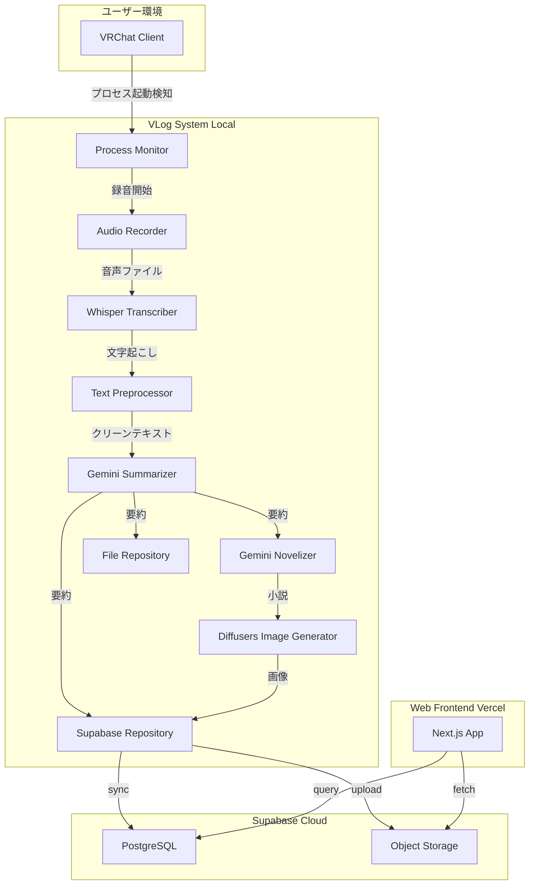

# VLog - Autonomous Life Logger 完全ドキュメント

> 開発コマンド・コーディング規約 → [AGENTS.md](file:///home/kafka/vlog/AGENTS.md)  
> システム構成図 → [docs/architecture.md](file:///home/kafka/vlog/docs/architecture.md)  
> 画像生成サブシステム → [docs/image.md](file:///home/kafka/vlog/docs/image.md)

## 目次

1. [プロジェクト概要](#プロジェクト概要)
2. [究極の目的と目標](#究極の目的と目標)
3. [アーキテクチャ](#アーキテクチャ)
4. [技術スタック](#技術スタック)
5. [システム構成](#システム構成)
6. [データフロー](#データフロー)
7. [環境設定](#環境設定)
8. [開発規則](#開発規則)
9. [利用ケース](#利用ケース)
10. [デプロイメント](#デプロイメント)
11. [API仕様](#api仕様)
12. [データベーススキーマ](#データベーススキーマ)
13. [運用ガイド](#運用ガイド)
14. [自律運用基準 (Autonomous Standards)](docs/usecases/autonomous_standards.md)
15. [ユースケース別ガイド (Use Cases)](#ユースケース別ガイド)
    - [VRChat](docs/usecases/vrchat.md)
    - [Discord](docs/usecases/discord.md)
    - [Mobile & Physical Life](docs/usecases/mobile_life.md)
    - [AI Glass](docs/usecases/ai_glass.md)

---

## プロジェクト概要

**VLog (Autonomous Life Logger)** は、デジタル体験（VRChat、Discord、システム音声など）から、物理的な体験（スマートフォンでのボイスメモ、外出、会議など）までをシームレスに記録し、AI生成による日記・小説・画像を作成するシステムです。

### プロジェクト情報

- **名前**: vlog
- **バージョン**: 0.1.0
- **説明**: Autonomous Life Logger
- **Python要件**: >=3.11
- **ライセンス**: 未指定

---

## 究極の目的と目標

### 最終目的

VRChatやDiscordなどのデジタル活動、またはスマートフォンでのボイスメモや現実世界での散歩・会議といった、あらゆる「人生の瞬間」を完全自動または簡単な操作で記録・保存し、後から振り返れる形で永続化すること。

### 具体的な目標

1. **完全自動化**
   - 特定のアプリケーション起動を検知、または常時音声監視による自動録音
   - 終了時に自動処理（文字起こし→要約→同期）
   - ユーザーの手動操作なしで日記生成

2. **高品質なコンテンツ生成**
   - 音声からの高精度文字起こし（Whisper Large-v3-turbo）
   - AI要約による読みやすい日記（Gemini 3 Flash）
   - 小説形式の長編ダイアリー生成
   - ビジュアル化（AI画像生成）

3. **永続化とアクセス性**
   - Supabaseクラウドストレージ
   - Web UIで過去のすべての記録を閲覧
   - 公開可能な形式での保存

4. **プライバシーとコントロール**
   - ローカルファイルとクラウドの二重保存
   - 公開/非公開の切り替え可能
   - 個人データの完全コントロール

---

## アーキテクチャ

Clean Architectureを採用。詳細なディレクトリ構造・コマンド一覧・コーディング規約は [AGENTS.md](file:///home/kafka/projects/vlog/AGENTS.md) を参照。

### 依存性の方向

```
Infrastructure → Use Cases → Domain
      ↑              ↑
      |              |
    App.py      Interfaces
```

- **Domain層**: 他の層に依存しない純粋なビジネスロジック
- **Use Cases層**: Domainインターフェースを使用、Infrastructureに依存しない
- **Infrastructure層**: 外部ライブラリ・API・DBへの実装

---

## 技術スタック

### バックエンド（Python 3.11+）

#### コア依存関係

| ライブラリ | バージョン | 用途 |
|-----------|----------|------|
| **sounddevice** | >=0.4.6 | オーディオ録音 |
| **soundfile** | >=0.12.1 | 音声ファイルIO（FLAC保存） |
| **numpy** | >=1.26.0 | 音声データ処理 |
| **psutil** | >=5.9.0 | プロセス監視（VRChat / Discord等検知） |
| **faster-whisper** | >=0.10.0 | 音声文字起こし |
| **google-generativeai** | >=0.8.0 | Gemini API（要約・小説生成） |
| **python-dotenv** | >=1.0.0 | 環境変数管理 |
| **pyyaml** | >=6.0.3 | 設定ファイル（config.yaml） |
| **supabase** | >=2.0.0 | Supabaseクライアント |
| **pydantic-settings** | >=2.12.0 | 型安全な設定管理 |

#### AI/ML依存関係

| ライブラリ | バージョン | 用途 |
|-----------|----------|------|
| **torch** | >=2.5.1 | PyTorch（GPU推論） |
| **diffusers** | git+latest | 画像生成モデル |
| **transformers** | >=4.46.3 | Hugging Face変換器 |
| **huggingface-hub** | >=0.26.2 | モデルダウンロード |
| **accelerate** | >=1.1.1 | GPU最適化 |
| **sentencepiece** | >=0.2.0 | トークナイザー |
| **nvidia-cublas-cu12** | >=12.1.3.1 | CUDA線形代数 |
| **nvidia-cudnn-cu12** | >=9.1.0.70 | CUDA深層学習 |

#### 開発ツール

| ツール | バージョン | 用途 |
|-------|----------|------|
| **ruff** | latest | リンター・フォーマッター |
| **uv** | latest | 高速パッケージマネージャー |

### フロントエンド（frontend/reader/）

| ライブラリ | バージョン | 用途 |
|-----------|----------|------|
| **Next.js** | ^16.1.0 | Reactフレームワーク（App Router） |
| **React** | 19.2.0 | UIライブラリ |
| **TypeScript** | ^5 | 型安全性 |
| **@supabase/supabase-js** | ^2.84.0 | Supabaseクライアント |

#### ディレクトリ構造

```
frontend/reader/
├── app/
│   ├── page.tsx           # メインページ（日記一覧・詳細モーダル）
│   ├── layout.tsx         # ルートレイアウト
│   └── globals.css        # スタイル
├── lib/
│   └── supabaseClient.ts  # Supabaseクライアント初期化
└── package.json
```

#### 主な機能

- `daily_entries`と`novels`テーブルから公開エントリ取得
- 検索・フィルタ機能（All/Summaries/Novels）
- 日付順ソート・カード表示・詳細モーダル
- 画像表示対応（`image_url`）

### インフラストラクチャ

- **Supabase**: バックエンドサービス（DB、認証、ストレージ）
- **Vercel**: フロントエンドホスティング
- **systemd**: Linuxサービス管理
- **Task**: タスクランナー（Taskfile.yaml）

---

## システム構成

### コンポーネント構成図



### ディレクトリ構造

```
vlog/
├── src/                    # Pythonソースコード
│   ├── domain/            # ドメイン層
│   ├── use_cases/         # ユースケース層
│   ├── infrastructure/    # インフラ層
│   ├── app.py            # アプリケーション
│   ├── cli.py            # CLI
│   └── main.py           # エントリポイント
├── frontend/              # Webフロントエンド
│   └── reader/           # Next.jsアプリ
├── data/                  # ローカルデータ
│   ├── recordings/       # 音声録音（FLAC）
│   ├── transcripts/      # 文字起こし結果
│   ├── summaries/        # 日次要約
│   ├── novels/           # 生成小説
│   ├── photos/           # 生成画像
│   ├── photos_prompts/   # 画像プロンプト
│   └── archives/         # アーカイブ済みファイル
├── docs/                  # ドキュメント
├── supabase/              # Supabase設定
│   └── schema.sql        # DBスキーマ
├── config.yaml            # アプリケーション設定
├── .env                   # 環境変数（秘密情報）
├── pyproject.toml         # Python依存関係
├── Taskfile.yaml          # タスク定義
└── vlog.service          # systemdサービス
```

---

## データフロー

### メインフロー: VRChat録音 → 日記生成

```
1. VRChat起動検知
   └─→ ProcessMonitor.is_running() = True

2. 録音開始
   └─→ AudioRecorder.start()
       └─→ data/recordings/{timestamp}.flac

3. VRChat終了検知
   └─→ ProcessMonitor.is_running() = False
   └─→ AudioRecorder.stop()

4. 処理パイプライン開始（別スレッド）
   └─→ ProcessRecordingUseCase.execute_session()
       ├─→ Transcriber.transcribe_and_save()
       │   └─→ Faster-Whisper (large-v3-turbo)
       │   └─→ data/transcripts/{timestamp}.txt
       │
       ├─→ TranscriptPreprocessor.process()
       │   ├─→ フィラー除去（「えー」「あのー」等）
       │   ├─→ 繰り返し除去
       │   └─→ 正規化
       │
       ├─→ Summarizer.summarize()
       │   └─→ Gemini 3 Flash
       │   └─→ data/summaries/{YYYYMMDD}_summary.txt
       │
       └─→ SupabaseRepository.sync()
           ├─→ daily_entries テーブル INSERT/UPSERT
           └─→ novels テーブル INSERT/UPSERT

5. 小説生成（オプション）
   └─→ BuildNovelUseCase.execute()
       ├─→ Novelizer.generate_chapter()
       │   └─→ Gemini 3 Flash
       │   └─→ data/novels/{YYYYMMDD}.md
       │
       └─→ ImageGenerator.generate_from_novel()
           ├─→ Jules.generate_image_prompt()
           │   └─→ Gemini 3 Flash
           │
           └─→ DiffusionPipeline (Z-Image-Turbo)
               └─→ data/photos/{YYYYMMDD}.png
               └─→ Supabase Storage: vlog-photos/{YYYYMMDD}.png
```

### サブフロー: Supabase同期

```
SupabaseRepository.sync()
├─→ _sync_summaries()
│   └─→ data/summaries/*.txt
│       └─→ daily_entries テーブル
│
├─→ _sync_novels()
│   └─→ data/novels/*.md
│       └─→ novels テーブル
│
└─→ _sync_photos()
    └─→ data/photos/*.png
        └─→ storage.vlog-photos/
        └─→ novels.image_url 更新
```

---

## 環境設定

### 必須環境変数（.env）

```bash
# Gemini APIキー（必須）
GOOGLE_API_KEY=AIza...

# Supabase認証情報
SUPABASE_URL=https://xxxxx.supabase.co
SUPABASE_SERVICE_ROLE_KEY=eyJ...

# フロントエンド用（公開キー）
NEXT_PUBLIC_SUPABASE_URL=https://xxxxx.supabase.co
NEXT_PUBLIC_SUPABASE_ANON_KEY=eyJ...

# オプション: Jules専用APIキー
GOOGLE_JULES_API_KEY=AIza...
```

### 設定ファイル（config.yaml）

```yaml
process:
  names: "VRChat.exe,VRChat,VRChatClient.exe"
  check_interval: 5  # 秒

paths:
  recording_dir: "data/recordings"
  transcript_dir: "data/transcripts"
  summary_dir: "data/summaries"
  archive_dir: "data/archives"
  photo_dir: "data/photos"
  photo_prompt_dir: "data/photos_prompts"

audio:
  sample_rate: 16000
  channels: 1
  block_size: 1024
  silence_threshold: 0.02
  max_duration_minutes: 30

processing:
  min_file_size_bytes: 102400
  min_duration_seconds: 10
  skip_if_processed: true
  archive_after_process: true

whisper:
  model_size: "large-v3-turbo"
  device: "cpu"  # または "cuda"
  compute_type: "int8"  # CPU用、GPU: "float16"
  beam_size: 5
  vad_filter: true
  language: "ja"
  vad_min_silence_duration_ms: 100
  vad_speech_pad_ms: 360
  chunk_length: 25
  temperature: 0.0
  repetition_penalty: 1.08
  word_timestamps: true

gemini:
  model: "gemini-3-flash"

novel:
  enabled: true
  title: "VRChat Long Diary 2025"
  out_dir: "data/novels"
  model: "gemini-3-flash"
  max_output_tokens: 4096

image:
  model: "Tongyi-MAI/Z-Image-Turbo"
  device: "cuda"
  width: 1024
  height: 1024
  num_inference_steps: 9
  guidance_scale: 0.0
  seed: 42
```

---

## 開発規則

コーディング規約・アーキテクチャ原則・品質管理コマンドは [AGENTS.md](file:///home/kafka/projects/vlog/AGENTS.md) を参照。

---

## 利用ケース

### ユースケース1: 自動日記生成

**アクター**: VLogシステム（自動）

**前提条件**:
- systemdサービスが稼働中
- VRChatがインストール済み

**メインフロー**:
1. ユーザーがVRChatを起動
2. システムがプロセスを検知
3. 音声録音を自動開始
4. ユーザーがVRChatをプレイ
5. ユーザーがVRChatを終了
6. システムが録音を停止
7. バックグラウンドで処理開始:
   - 文字起こし
   - テキスト前処理
   - AI要約
   - Supabase同期
8. 要約テキストが`data/summaries/`に保存
9. Supabaseの`daily_entries`テーブルに保存

**成功条件**:
- 要約ファイルが生成される
- Supabaseにデータが同期される
- Web UIで閲覧可能になる

---

### ユースケース2: 手動ファイル処理

**アクター**: ユーザー

**メインフロー**:
1. ユーザーがTaskコマンド実行:
   ```bash
   task process FILE=data/recordings/20251204_120000.flac
   ```
2. システムが指定ファイルを処理
3. 結果が生成される

---

### ユースケース3: 小説章生成

**アクター**: ユーザー

**メインフロー**:
1. 要約ファイルが既に存在
2. ユーザーがコマンド実行:
   ```bash
   task novel:build date=20251204
   ```
3. システムが小説章を生成
4. 画像を自動生成
5. Supabaseに同期

---

### ユースケース4: Web閲覧

**アクター**: ユーザー

**メインフロー**:
1. ユーザーがブラウザでアクセス
2. Next.jsアプリがSupabaseからデータ取得
3. 日記一覧を表示
4. ユーザーが特定の日記を選択
5. 詳細ページで要約・小説・画像を表示

---

## デプロイメント

### ローカル実行

#### 初回セットアップ

```bash
# 1. 依存関係インストール
task setup

# 2. 環境変数設定
cp .env.example .env
# .envを編集してAPIキーを設定

# 3. Supabaseスキーマ適用
# Supabase管理画面でschema.sqlを実行
```

#### 開発モード

```bash
# アプリケーション実行
task dev

# Web UI開発サーバー
task web:dev
```

#### systemdサービス化

```bash
# サービス有効化・起動
task up

# ステータス確認
task status

# ログ確認
task logs

# 停止
task down

# 再起動
task restart
```

### Vercelデプロイ

```bash
# フロントエンドデプロイ
task web:deploy
```

### Windows実行

```batch
REM Windows実行（単一エントリポイント）
windows\run.bat
```

---

## API仕様

### CLIコマンド

#### `process` - ファイル処理

```bash
task process FILE=path/to/audio.flac
```

**動作**:
1. 文字起こし
2. 前処理
3. 要約
4. Supabase同期
5. アーカイブ

---

#### `novel:build` - 小説生成

```bash
task novel:build [date=YYYYMMDD]
```

**動作**:
1. 指定日（デフォルト: 今日）の要約を読み込み
2. Geminiで小説章を生成
3. 画像を生成
4. Supabaseに同期

---

#### `sync` - Supabase同期

```bash
task sync
```

**動作**:
- `data/summaries/*.txt` → `daily_entries`
- `data/novels/*.md` → `novels`
- `data/photos/*.png` → `storage.vlog-photos`

---

#### `photo` - 画像生成

```bash
task photo novel=data/novels/20251204.md
```

**動作**:
1. 小説テキストから画像プロンプト生成
2. Diffusionモデルで画像生成
3. `data/photos/`に保存

---

### Python API

#### ProcessRecordingUseCase

```python
from src.use_cases.process_recording import ProcessRecordingUseCase
from src.infrastructure.system import Transcriber, TranscriptPreprocessor
from src.infrastructure.ai import Summarizer
from src.infrastructure.repositories import SupabaseRepository, FileRepository

use_case = ProcessRecordingUseCase(
    transcriber=Transcriber(),
    preprocessor=TranscriptPreprocessor(),
    summarizer=Summarizer(),
    storage=SupabaseRepository(),
    file_repository=FileRepository(),
)

success = use_case.execute("data/recordings/audio.flac")
```

#### BuildNovelUseCase

```python
from src.use_cases.build_novel import BuildNovelUseCase
from src.infrastructure.ai import Novelizer, ImageGenerator

use_case = BuildNovelUseCase(
    novelizer=Novelizer(),
    image_generator=ImageGenerator(),
)

novel_path = use_case.execute(date="20251204")
```

---

## データベーススキーマ

### Supabase PostgreSQL

#### テーブル: `daily_entries`

| カラム | 型 | 説明 |
|--------|------|------|
| `id` | uuid | 主キー |
| `file_path` | text | ローカルファイルパス（UNIQUE） |
| `date` | date | 日付 |
| `title` | text | タイトル |
| `content` | text | 要約テキスト |
| `tags` | text[] | タグ配列 |
| `is_public` | boolean | 公開フラグ |
| `created_at` | timestamptz | 作成日時 |
| `updated_at` | timestamptz | 更新日時 |

**インデックス**:
- `file_path` (UNIQUE)
- `date`

---

#### テーブル: `novels`

| カラム | 型 | 説明 |
|--------|------|------|
| `id` | uuid | 主キー |
| `file_path` | text | ローカルファイルパス（UNIQUE） |
| `date` | date | 日付 |
| `title` | text | タイトル |
| `content` | text | 小説テキスト（Markdown） |
| `image_url` | text | 生成画像URL |
| `tags` | text[] | タグ配列 |
| `is_public` | boolean | 公開フラグ |
| `created_at` | timestamptz | 作成日時 |
| `updated_at` | timestamptz | 更新日時 |

**インデックス**:
- `file_path` (UNIQUE)
- `date`

---

#### ストレージバケット: `vlog-photos`

- **公開**: true
- **保存形式**: `photos/{YYYYMMDD}.png`

---

### Row Level Security (RLS)

#### daily_entries

```sql
-- 読み取り: is_public=true のみ
CREATE POLICY "Public entries are viewable by everyone"
ON daily_entries FOR SELECT
USING (is_public = true);

-- Service Role: すべて許可
CREATE POLICY "Service role can do everything on daily_entries"
ON daily_entries FOR ALL
USING (true) WITH CHECK (true);
```

#### novels

```sql
-- 読み取り: is_public=true のみ
CREATE POLICY "Public novels are viewable by everyone"
ON novels FOR SELECT
USING (is_public = true);

-- Service Role: すべて許可
CREATE POLICY "Service role can do everything on novels"
ON novels FOR ALL
USING (true) WITH CHECK (true);
```

#### storage.objects

```sql
-- 読み取り: vlog-photosバケットすべて
CREATE POLICY "Photos are viewable by everyone"
ON storage.objects FOR SELECT
USING (bucket_id = 'vlog-photos');

-- アップロード・更新: Service Roleのみ
CREATE POLICY "Service role can upload photos"
ON storage.objects FOR INSERT
WITH CHECK (bucket_id = 'vlog-photos');

CREATE POLICY "Service role can update photos"
ON storage.objects FOR UPDATE
USING (bucket_id = 'vlog-photos');
```

---

## 運用ガイド

コマンド一覧（`task up`, `task status`, `task sync` 等）は [AGENTS.md](file:///home/kafka/projects/vlog/AGENTS.md) を参照。

### トラブルシューティング

#### 録音されない

1. VRChatプロセス名を確認: `ps aux | grep -i vrchat`
2. `config.yaml`の`process.names`を調整
3. サービス再起動: `task restart`

#### 文字起こし失敗

1. Whisperモデルがダウンロード済みか確認
2. CPUモード時はメモリ確認
3. GPU利用時は`whisper.device: "cuda"`、`compute_type: "float16"`を設定

#### Gemini APIエラー

1. APIキー確認: `grep GOOGLE_API_KEY .env`
2. API利用上限確認（Google AI Studio）
3. モデル名確認: `gemini.model: "gemini-3-flash"`

#### Supabase同期エラー

1. 認証情報確認: `grep SUPABASE .env`
2. ネットワーク接続確認
3. RLSポリシー確認（管理画面）

---

### パフォーマンス最適化

#### GPU利用

```yaml
# config.yaml
whisper:
  device: "cuda"
  compute_type: "float16"

image:
  device: "cuda"
```

#### CPU最適化

```yaml
# config.yaml
whisper:
  model_size: "base"  # または "medium"
  device: "cpu"
  compute_type: "int8"
```

---

## 顧客・ユーザーストーリー

### 想定ユーザー

- VRChatプレイヤー
- 自分の活動を記録したい人
- 後から思い出を振り返りたい人

### ユーザーストーリー

#### ストーリー1: 自動記録

> 「VRChatで遊んでいる間、自動的に会話を記録してほしい。終わったら勝手に日記にまとめてほしい。」

**解決**: ProcessMonitorがVRChat起動を検知し、自動録音・処理を実行

---

#### ストーリー2: 長期記録

> 「1年分の日記をまとめて、長編小説みたいに読みたい。」

**解決**: Novelizerが日次要約から章を生成、連続した物語に

---

#### ストーリー3: ビジュアル化

> 「文字だけじゃなくて、その日の雰囲気を表す画像も欲しい。」

**解決**: ImageGeneratorが小説から画像を自動生成

---

#### ストーリー4: どこからでもアクセス

> 「スマホからも過去の日記を見たい。」

**解決**: SupabaseクラウドストレージとNext.js WebUIでどこからでもアクセス可能

---

## 技術仕様詳細

### 音声録音仕様

- **フォーマット**: FLAC（ロスレス圧縮）
- **サンプルレート**: 16kHz
- **チャンネル**: モノラル
- **ビット深度**: 16bit
- **ブロックサイズ**: 1024サンプル
- **無音閾値**: RMS 0.02
- **最大録音時間**: 30分（設定可能）

### Whisper文字起こし仕様

- **モデル**: large-v3-turbo
- **言語**: ja（日本語）
- **VADフィルター**: 有効
- **ビームサイズ**: 5
- **温度**: 0.0（決定論的）
- **繰り返しペナルティ**: 1.08
- **単語タイムスタンプ**: 有効

### Gemini生成仕様

#### 要約生成

- **モデル**: gemini-3-flash
- **最大トークン**: デフォルト
- **プロンプトテンプレート**: `src/infrastructure/summarizer_prompt.txt`

#### 小説生成

- **モデル**: gemini-3-flash
- **最大トークン**: 4096
- **プロンプトテンプレート**: `src/infrastructure/novelizer_prompt.txt`

### 画像生成仕様

- **モデル**: Tongyi-MAI/Z-Image-Turbo
- **解像度**: 1024x1024
- **推論ステップ**: 9
- **ガイダンススケール**: 0.0（CFG不使用）
- **シード**: 42（固定）

---

## セキュリティとプライバシー

### データ保護

1. **ローカルファイル**
   - `data/`ディレクトリに保存
   - gitignoreで除外

2. **環境変数**
   - `.env`ファイルでAPIキー管理
   - gitignoreで除外

3. **Supabase**
   - RLSで公開制御
   - Service Roleキーは秘密情報

### 推奨事項

- APIキーを共有しない
- `.env`をバージョン管理に含めない
- `is_public=false`で非公開設定可能

---

## 今後の拡張可能性

### 計画中の機能

1. **多言語対応**
   - Whisperの言語自動検出
   - 多言語要約

2. **感情分析**
   - 会話の感情スコアリング
   - 楽しさ・悲しさをビジュアル化

3. **スピーカー分離**
   - 複数話者の識別
   - 誰が何を話したか記録

4. **検索機能強化**
   - 全文検索
   - タグ検索
   - 日付範囲検索

5. **認証機能**
   - Supabase Auth統合
   - プライベート日記の完全保護

---

## まとめ

VLogは、VRChat体験を完全自動で記録・永続化するシステムです。Clean Architectureに基づいた堅牢な設計、最新のAI技術（Whisper、Gemini、Diffusers）の活用、クラウドストレージとの統合により、高品質な日記・小説・画像を生成します。

プロジェクトはコーディング規則を厳格に守り、保守性と拡張性を重視しています。fail-fast原則、型安全性、依存性の逆転などの設計原則により、長期的なメンテナンスが容易です。

このドキュメントは、プロジェクトのすべての側面を網羅しており、新規開発者のオンボーディング、運用担当者のトラブルシューティング、意思決定者の技術理解に役立ちます。
