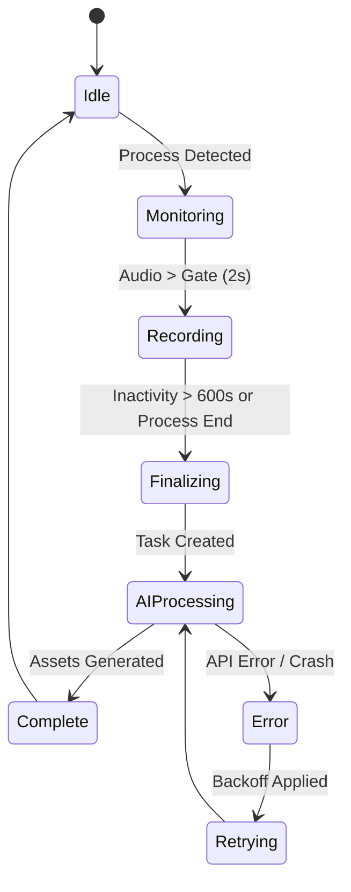

# 自律運用の基準（基本原則）

このドキュメントでは、VLogが「製品」として成立するための完全自律運用の基準を、実装レベルのステートマシンおよび技術定数として定めます。

## 1. 人間の介入ゼロ（Zero-Ops Protocol）
- **自動検知ロジック**: `infrastructure/process.rs` にて `libc` または `sysinfo` を介し、ターゲットプロセス（例: `Discord.exe`）の出現を 1.0s の解像度で監視。
- **自動処理パイプライン**: `use_cases/process.rs` が `TaskRepository` から `pending` を抽出し、`tokio::spawn` によるマルチスレッド並列処理を自律的にスケジューリング。

## 2. 壊れても勝手に直る（Crash-Only Architecture）
- **ステート・チェックポインティング**: 録音中の PCM データは 30 秒ごとに `data/recordings/partial/` にフラッシュ。
- **Auto-Restart ポリシー**: `systemd` ユニット設定における `Restart=always` および `RestartSec=10` の強制適用。
- **リソース隔離**: メインループ（Monitoring）と重い AI 処理（Processing）を別プロセスまたは独立した Async Runtime で分離。

## 3. 自己修復メカニズム（Self-Healing Logic）
- **Jitter 付き指数バックオフ**: `llm.rs` における再試行間隔の算出式：`min(cap, base * 2^n) + random_jitter`。
- **データ不備の自動スキャン**: 起動時に `data/tasks.json` を全スキャンし、`image_path == null` の項目を自動的に再生成キューへ投入。
- **OOM 保護**: `cgroups` (Linux) を用いたプロセスメモリ制限 と、制限接近時の GC 強制発動。

## 4. データの絶対保護（Data Safety Standard）
- **ACID 準拠の保存**: `data/status.json` 等の更新時、`rename(tmp, target)` によるアトミック性を保証。
- **非対称同期**: クラウド側（Remote）の削除操作をローカル（Local）に波及させない「一方向追記型シンク」の採用。
- **ID 衝突回避**: `Snowflake ID` または `UUID v7`（時間順序付き）を用いた全リソースのユニーク性担保。

## 網羅的達成基準（Definition of Done）

本システムの「自律稼働」が達成されたと判断するための、全観点からの具体的指標です。

### 1. 運用・信頼性（Zero-Ops / Crash-Only）
- [ ] **168時間（1週間）無人連続稼働の達成**
    - [ ] 期間中、メモリ使用量の増加（RSS）が初期値の +20% 以内に収まっていること。
    - [ ] `systemd` によるプロセスの「予期せぬ終了/再起動」が 0 回であること。

### 2. データ・品質（Narrative Integrity）
- [ ] **ライフログの「一貫性」証明**
    - [ ] `data/eval/cases/` の標準セットにおいて、WER（文字起こし誤り率）が平均 5.0% 以下を維持していること。

### 3. モニタリング・可観測性（Observability）
---
**総評**: 上記の全項目が「済(x)」となった状態をもって、VLog システムは「製品レベルの自律性」を獲得したと認定されます。
