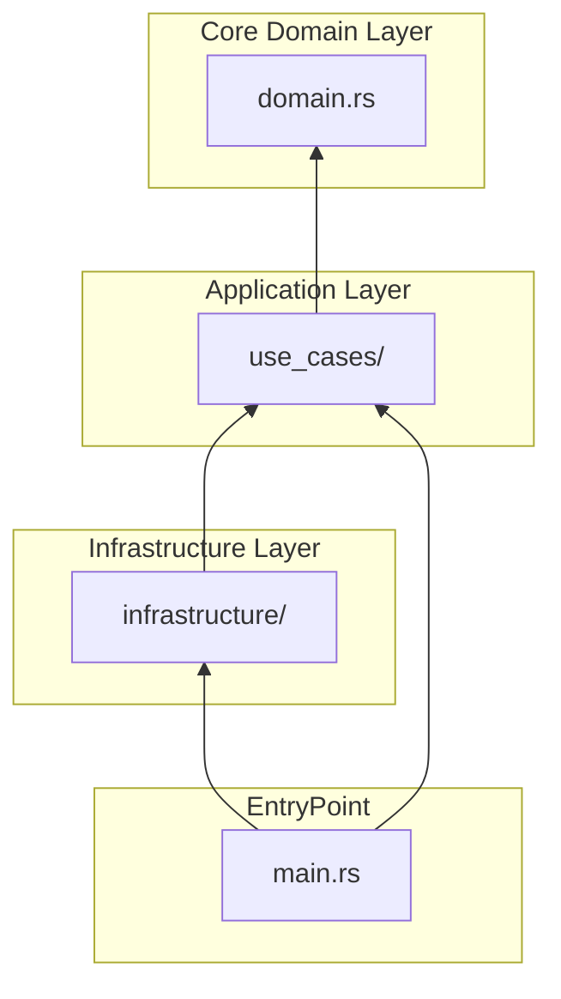
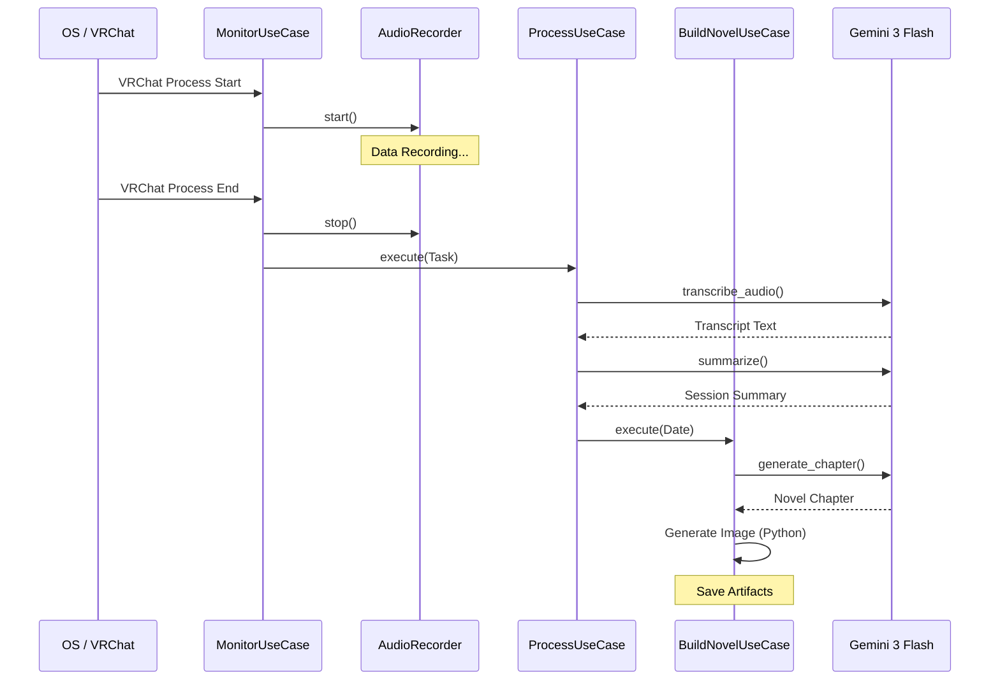

# Source Code Overview (ソースコード概要)

本ディレクトリは、VRChat Auto-Diary "VLog" のコアロジックを格納しています。プロジェクトは **Clean Architecture** と **Iron Rules** に基づいて厳格に管理されています。

## アーキテクチャ構成

VLogは以下の階層構造で設計されています。依存関係は外側から内側（Infrastructure → Use Cases → Domain）へと一方向に流れます。



## システム実行シーケンス

VRChatの起動検知から小説生成までの全体的な流れは以下の通りです。




### ディレクトリ役割
- **[infrastructure/](file:///home/kafka/vlog/src/infrastructure/README.md)**: 外部通信（Gemini 3 Flash, Supabase）、オーディオ録音、ファイルI/Oの具象実装。
- **[use_cases/](file:///home/kafka/vlog/src/use_cases/README.md)**: アプリケーションのビジネスルール（録音処理パイプライン、小説生成フロー）のオーケストレーション。
- **[domain.rs](file:///home/kafka/vlog/src/domain.rs)**: システムの核心となるエンティティとインターフェース（Trait）の定義。
- **[scripts/](file:///home/kafka/vlog/src/scripts/README.md)**: AI画像生成など、専門的なPythonスクリプト。
- **[main.rs](file:///home/kafka/vlog/src/main.rs)**: 依存性の注入（DI）とCLIエントリポイント。

## なぜこの設計なのか (Why this Architecture?)

1. **技術的負債の最小化**: `infrastructure` を分離することで、LLMのモデル変更（例: Gemini-1.5 → Gemini-3-Flash）やデータベースの移行を、ビジネスロジックに影響を与えずに行うことができます。
2. **Iron Rulesの遵守**: 複雑さを排除し、各コンポーネントが自立して「パニック（クラッシュ）」できる安全な境界線を定義しています。
3. **Rustの活用**: 性能が要求される前処理や並列処理をRustで実装し、AIエコシステムが必要な部分のみをPython（scripts/）に限定しています。

## ナレッジ: ルールとしての「クラッシュ・オンリー」
本プロジェクトでは、回復不能なエラーが発生した場合、中途半端な状態で処理を続行するのではなく、即座に終了（panic）することを推奨しています。これは、不正確な日記が生成されたり、データが破損したりすることを防ぐための「防御的プログラミング」の究極の形です。

## How-to: 開発の始め方

### 新機能の追加フロー
1. `domain.rs` で必要なインターフェース（Trait）を定義する。
2. `infrastructure/` でその Trait を実装する。
3. `use_cases/` で実装を組み合わせて業務ロジックを構成する。
4. `main.rs` で DI を行い、CLIコマンドとして公開する。

### 規約チェック
変更を加えた後は、必ず以下のコマンドを実行してください。
```bash
cargo fmt --all           # フォーマット確認
cargo clippy -- -D warnings # 静的解析（警告をエラーとして扱う）
```
