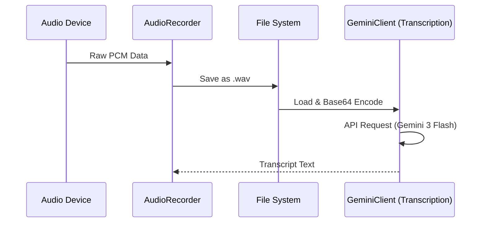

# Infrastructure Layer (インフラストラクチャ層)

本ディレクトリは、外部システム（Gemini API、OSのオーディオデバイス、ファイルシステムなど）との通信を担当する具象実装を配置しています。

## 責務
- **LLM通信**: Gemini APIを使用したテキスト生成、音声書き起こし、コンテンツ評価 ([llm.rs](file:///home/kafka/vlog/src/infrastructure/llm.rs), [ai.rs](file:///home/kafka/vlog/src/infrastructure/ai.rs))。
- **オーディオ制御**: デバイスからの音声録音と保存 ([audio.rs](file:///home/kafka/vlog/src/infrastructure/audio.rs))。
- **データ前処理**: 生の書き起こしデータのクレンジングと整形 ([preprocessor.rs](file:///home/kafka/vlog/src/infrastructure/preprocessor.rs))。
- **外部API**: Supabase等の外部サービスとのデータ同期 ([api.rs](file:///home/kafka/vlog/src/infrastructure/api.rs))。

## 主要コンポーネントのフロー

### オーディオデータフロー

## ナレッジ: なぜRustでデータ前処理を行うのか？
`preprocessor.rs` におけるデータ整形は、LLMに渡す前の重要なステップです。 Rustを採用している理由は以下の通りです：

1. **メモリ安全性**: 大規模な文字列操作においてもセグメンテーションフォルトのリスクを排除します。
2. **パフォーマンス**: 正規表現や文字列スライスによるクレンジングをミリ秒単位で完了させ、パイプラインのボトルネックを防ぎます。
3. **型の厳格性**: `New Type Idiom` を活用し、未清掃のデータと清掃済みのデータを型レベルで区別します（Iron Rulesの遵守）。

## How-to: 設定の変更
システムの動作設定は [settings.rs](file:///home/kafka/vlog/src/infrastructure/settings.rs) で管理されています。環境変数または設定ファイルを介して注入されることを想定しており、ハードコードは厳禁です。
