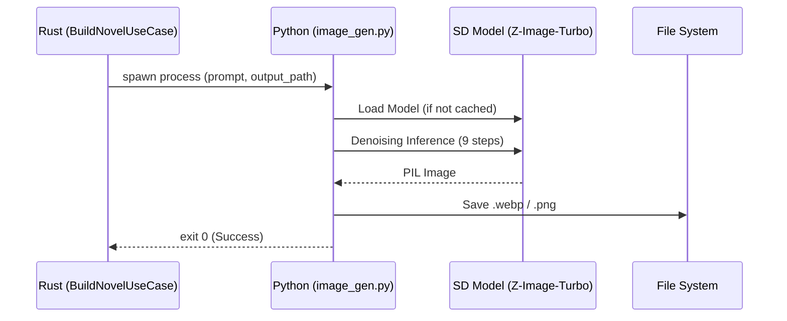

# Scripts Directory (スクリプトディレクトリ)

本ディレクトリは、Rustのメインロジックを補助する補助スクリプトや、特定の専門知識を必要とするツールを配置しています。

## 責務
- **画像生成**: プロンプトを元にしたAI画像生成 ([image_gen.py](file:///home/kafka/vlog/src/scripts/image_gen.py))。

## 実行シーケンス




## 主要ツール

### `image_gen.py`
このスクリプトは、Stability AI APIまたはローカルのStable Diffusionを介して画像を生成するために使用されます。Rust側から `std::process::Command` を通じて呼び出されることを想定しています。

#### 技術的背景 (Why Python?)
Rust-Firstを掲げていますが、以下の理由で一部のコンポーネントにPythonを残しています：
1. **ライブラリ・エコシステム**: PyTorchやDiffusersなどのAI画像生成ライブラリはPythonネイティブであり、Rustからの呼び出しよりも直接的な制御が可能です。
2. **高速なプロトタイピング**: プロンプトエンジニアリングやモデルの微調整を高速に行うため。

## How-to: 使用方法

### セットアップ
```bash
# 仮想環境の作成
python3 -m venv venv
source venv/bin/activate
pip install -r requirements.txt
```

### 実行
```bash
python3 src/scripts/image_gen.py --prompt "masterpiece, 8k, VRChat world" --output data/photos/test.png
```

## 注意事項: Iron Rulesの適用
本ディレクトリのPythonコードも、可能な限り **Iron Rules** に準拠してください。
- 不要なコメントの削除。
- 厳密な型ヒント (`typing`) の使用。
- エラーハンドリングの簡素化（例外をキャッチせず、即座にクラッシュさせる）。
