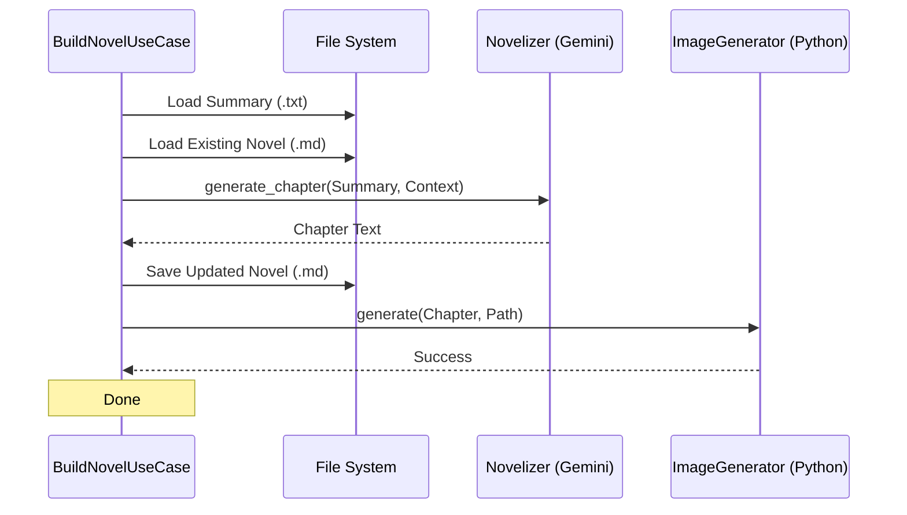
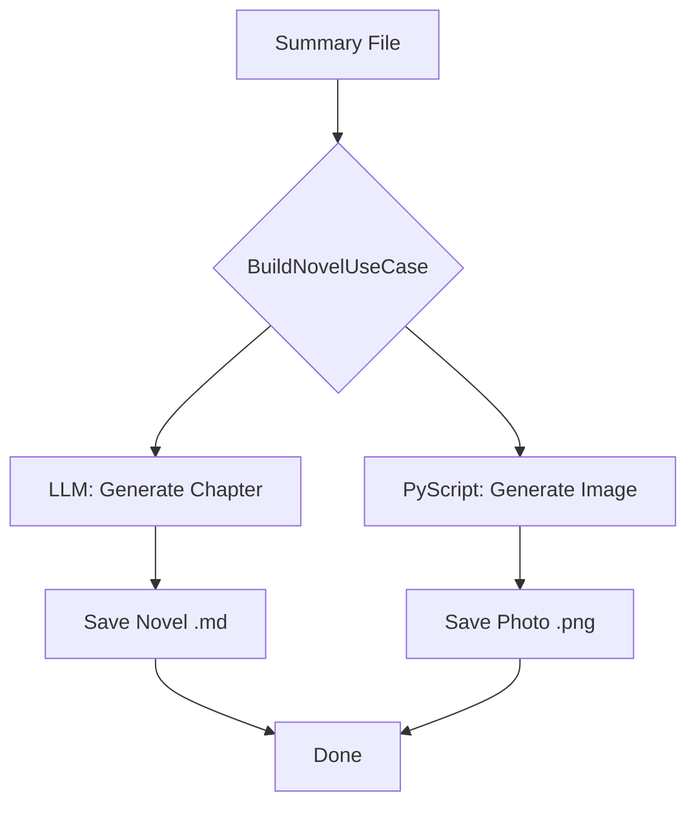

# Use Cases Layer (ユースケース層)

本ディレクトリは、ビジネスロジックのオーケストレーションを担当します。Infrastructure層の具象実装を組み合わせ、アプリケーションの特定の機能を実行します。

## 責務
- **セッション実行**: 音声書き起こし、前処理、要約の一連のフローを制御 ([process.rs](file:///home/kafka/vlog/src/use_cases/process.rs))。
- **小説生成**: 要約データを元に小説の章と画像を生成 ([build_novel.rs](file:///home/kafka/vlog/src/use_cases/build_novel.rs))。
- **監視・同期**: プロセスの進捗監視や外部DBとの同期 ([monitor.rs](file:///home/kafka/vlog/src/use_cases/monitor.rs), [sync.rs](file:///home/kafka/vlog/src/use_cases/sync.rs))。

## プロセスフロー

### 小説執筆パイプライン (シーケンス)

### 小説執筆パイプライン (依存関係)

## ナレッジ: なぜUse CaseとInfrastructureを分離するのか？
クリーンアーキテクチャの原則に基づき、ビジネスロジック（Use Case）を外部詳細（Infrastructure）から隔離しています。

1. **テスト容易性**: 実際のLLM APIやファイルシステムをモックに差し替えることで、ロジックのみを高速にテスト可能です（※Iron Rulesにより現在はテストコード自体は削除されていますが、構造的な設計意図として重要です）。
2. **変更への耐性**: 音声処理ライブラリを `cpal` から別のものに変更したり、LLMをGemini 3 Flashから別のモデルへ移行する際、ビジネスロジックを一切修正せずに済みます。

## How-to: 新しいアクションの追加
1. 新しい `UseCase` 構造体を定義します。
2. 必要な `Trait`（Domain層で定義）を注入するように `new` 関数を記述します。
3. `main.rs` で依存性を注入（DI）し、呼び出します。
