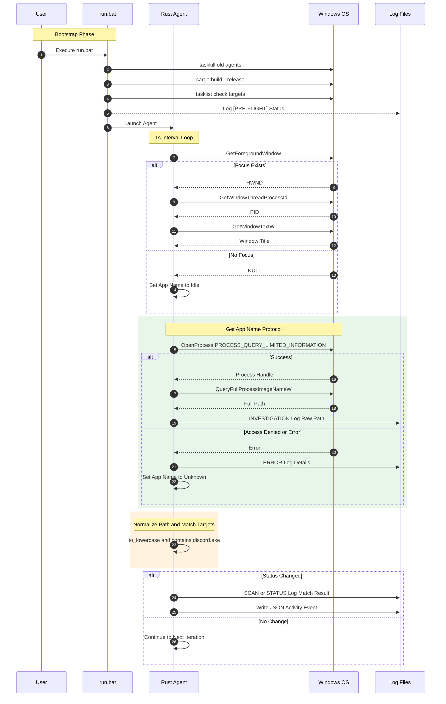

# Windows Agent Process Detection & Reliability Protocol

## 1. 背景と目的
VLog Windows Agent はユーザーの利用状況を正確に記録し、物理的現実をキャプチャすることを目的とする。ターゲットの検知漏れだけでなく、非ターゲット時の挙動やアイドル状態も鉄の掟に基づき全件記録する。これは物理的現実を欠落なく保存するためである。

## 2. 現状の問題点
1.  検知失敗 NO MATCH
    *   ウィンドウタイトルは取得できているがプロセス名が特定できない。
    *   API OpenProcess や QueryFullProcessImageNameW がエラー、または Unknown を返す。
2.  パス形式の不一致
    *   Rust側での期待: Discord.exe
    *   実際のAPI戻り値:
        *   C:\Users\...\Discord.exe
        *   \\?\HarddiskVolume3\...\Discord.exe
    *   結果: 単純な等価比較が失敗する。
3.  権限とアクセス拒否
    *   VRChat などの保護されたプロセスに対し通常の OpenProcess が拒否される可能性がある。
    *   PROCESS_QUERY_LIMITED_INFORMATION を使用し最小権限で実行する必要がある。

## 3. あるべき姿
1.  完全なパス正規化
    *   どのようなパス形式が返ってきても小文字化 と 部分一致 で確実に判定する。
2.  堅牢なエラーハンドリング
    *   API呼び出し失敗時、単に Unknown とせず Windows エラーコードをログに残し原因を特定可能にする。
3.  常時記録の徹底
    *   Discord や VRChat 以外のアプリ使用時や、ウィンドウがアクティブでない Idle 状態も全件ログに記録する。
4.  証拠に基づくデバッグ
    *   動かない ではなく このパスが来たからマッチしなかった という事実ベースで修正サイクルを回す。
    *   ログタグ INVESTIGATION を使用し生データを常に可視化する。

## 4. 期待されるログと表示
正常動作時、ログには以下のような明確な成功ステータスが表示されなければならない。

### 起動時
```ansi
 [1;32m[STATUS] [0m Process Monitor:  [1;34mACTIVE [0m Targets: Discord, VRChat
 [1;32m[STATUS] [0m Audio Ingest:  [1;34mREADY [0m inbox/audio
 [1;32m[STATUS] [0m File Watcher:  [1;34mACTIVE [0m
```

### 検知時 Success
```diff
+ [SCAN] Process: 'Discord.exe' (Title: ' #general - Discord') -> Match: DISCORD
```

### 非ターゲット時 No Match
```ansi
 [1;34m[SCAN] [0m Process: 'Notepad.exe' (Title: 'memo.txt - Notepad') -> Match: NONE
```

### アイドル時 Idle
```ansi
 [1;30m[SCAN] [0m Process: 'Idle' (Title: 'No Active Window') -> Match: NONE
```

### JSON出力例
```json
{
  "timestamp": "2026-02-19T...",
  "app_name": "Discord.exe",
  "is_discord": true,
  "is_vrchat": false,
  "status": "active"
}
```
*   Match: の後に判定結果が表示されること。
*   非ターゲット時は Match: NONE と表示されること。

## 5. 必須デバッグログ
問題発生時、以下のログが必ず出力され、貼り付けられなければならない。これがない報告は証拠なしとみなす。

### 1. 生パス調査ログ
```ansi
 [1;35m[INVESTIGATION] [0m PID: 1234 -> Full Path: 'C:\Users\Kafka\AppData\Local\Discord\app-1.0.9001\Discord.exe'
```

### 2. APIエラーログ
```ansi
 [1;31m[ERROR] [0m OpenProcess failed for PID 5678: Access is denied. os error 5
```

## 6. 具体的な調査手順
1.  run.bat で古いプロセスを終了しクリーンに開始する。
2.  対象アプリをアクティブにする。
3.  logs\windows-rust-agent.log を開き INVESTIGATION 行を抽出する。
4.  抽出したログを基に判定ロジックを修正する。

## 7. システムブートストラップと検知シーケンス


